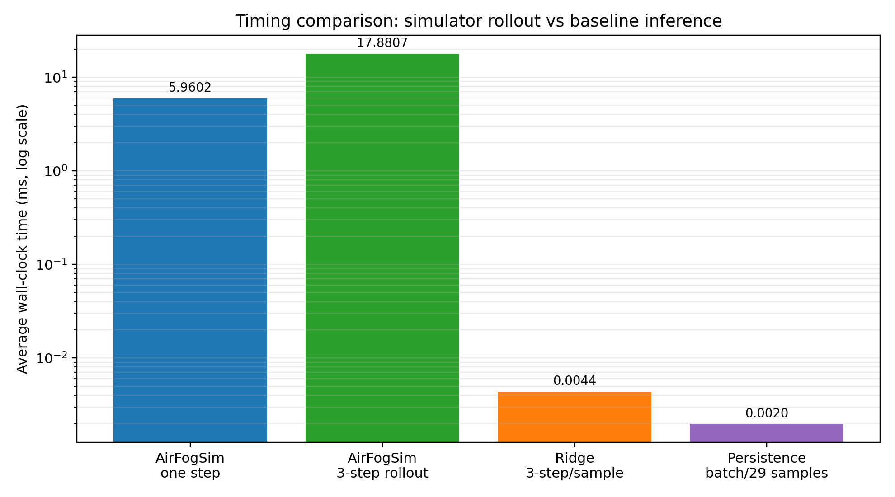
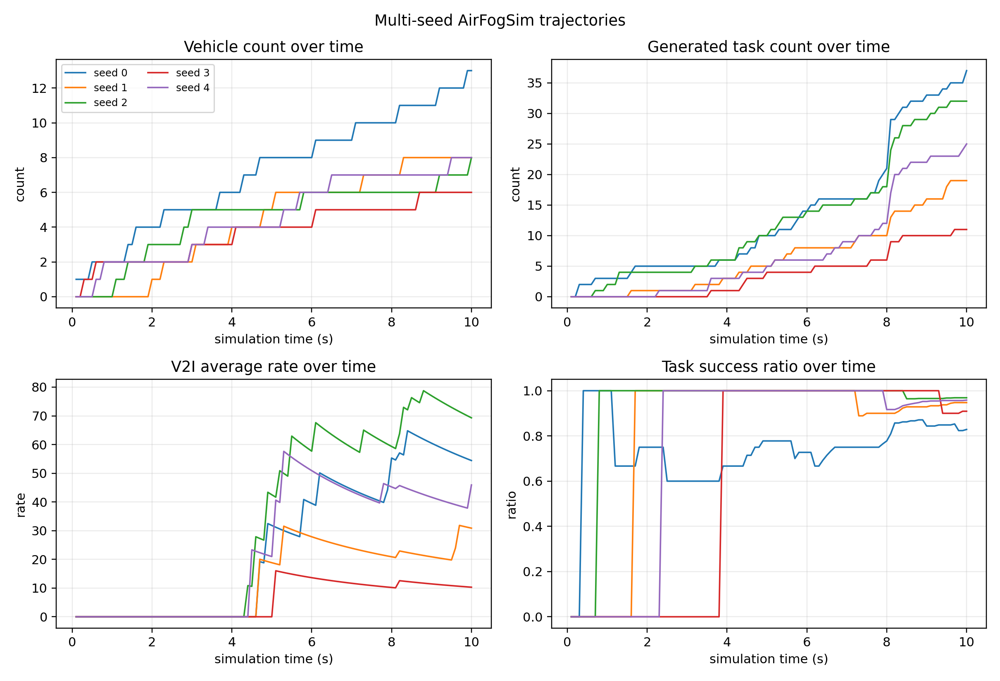

# 本周实验与分析结果汇总 v0

## 1. 当前已经做到什么

本周不是只停留在“平台跑起来”，而是已经把后续 world model 需要的几条基础链路跑通了：

| 工作 | 产出 | 可以说明什么 |
|---|---|---|
| dataset_v0 构造 | `dataset_v0_samples.npz` | 原始仿真日志已经整理成历史窗口到未来标签的训练样本 |
| baseline 训练 | `baseline_v0/` | 当前数据可以进入训练、验证、测试流程 |
| 扰动测试 | `robustness_v0/` | 已经能评估输入噪声对预测误差的影响 |
| 置信区间 | `uncertainty_v0/` | 已经能给点预测结果补充预测区间 |
| AirFogSim 机制分析 | `airfogsim_analysis_v0/` | 已经梳理仿真器内部状态转移、随机性和复杂度来源 |
| 计时实验 | `timing_v0/` | 已经得到仿真器 rollout 与轻量模型推理的第一版耗时对比 |
| 多 seed 仿真 | `multiseed_v0/` | 已经验证同一场景在不同随机种子下会产生不同轨迹 |

这几项合起来说明：我们现在不只是有数据文件，而是有了“仿真产出数据 -> 构造训练样本 -> baseline 预测 -> 扰动评估 -> 不确定性估计 -> 机制解释”的完整实验雏形。

## 2. baseline 结果怎么解释

当前 baseline 的目标不是追求最终最好性能，而是确认 `dataset_v0` 能不能被模型使用。

| 模型 | 全部 RMSE | 链路 RMSE | 任务 RMSE | 解释 |
|---|---:|---:|---:|---|
| persistence | 1.345 | 1.180 | 1.396 | 直接用最后一个历史状态延续到未来，短期预测中很强 |
| Ridge residual | 1.224 | 1.664 | 1.037 | 对任务状态预测更好，但链路速率不如 persistence |
| MLP residual | 8.469 | 16.786 | 1.307 | 当前小样本、高维输入下不稳定 |

汇报时可以这样讲：

> 第一版 baseline 已经跑通。由于仿真步长是 0.1 秒，预测未来 3 步只对应 0.3 秒，所以短期状态变化不大，persistence 会是一个很强的基线。Ridge residual 在任务状态上有提升，但链路速率还不够好，说明后续需要更结构化的图模型，而不是简单把所有特征展平。

这里最重要的点是：persistence 强不是坏事，它给了我们一个明确门槛。后续模型必须超过这个门槛，才算真正有价值。

## 3. 扰动实验结果怎么解释

扰动实验是在输入侧加噪声，标签仍然保持原始未来状态。它模拟的是“观测不准、链路测量有噪声、任务负载估计不准”的情况。

| 噪声强度 | persistence 全部 RMSE | Ridge residual 全部 RMSE | 主要现象 |
|---:|---:|---:|---|
| 0.00 | 1.345 | 1.224 | 无扰动时 Ridge 整体略好 |
| 0.05 | 1.545 | 1.724 | 两者误差上升 |
| 0.10 | 2.470 | 2.651 | 任务状态误差明显增大 |
| 0.20 | 4.145 | 5.215 | Ridge residual 退化更明显 |
| 0.30 | 5.998 | 7.270 | 强扰动下当前学习式 baseline 不够稳 |

汇报时要谨慎：

> 当前不能说我们的方法已经更抗干扰。现在能说的是，扰动评估流程已经建立起来了；第一版 residual baseline 在强扰动下会退化，说明后续需要引入扰动训练、更强正则，或者用物理图和通信图结构约束模型，让模型不要过度依赖单个噪声特征。

这个结果反而是有意义的，因为它指出了下一步改模型的方向。

## 4. 置信区间结果怎么解释

当前置信区间不是复杂贝叶斯模型，而是轻量的验证集残差分位数方法。做法是：

1. 用训练集训练 Ridge residual baseline。
2. 在验证集上统计预测残差分布。
3. 用残差分位数给测试集预测值加上下界和上界。

当前结果：

| 区间 | 整体覆盖率 | 平均宽度 | 解释 |
|---|---:|---:|---|
| 90% | 0.902 | 5.517 | 覆盖率接近目标 90%，但区间偏宽 |
| 80% | 0.849 | 2.105 | 覆盖率略高于 80%，区间更窄 |

汇报时可以说：

> 这一版已经不是只输出一个点预测，而是能输出预测区间。当前方法比较轻量，主要用于建立不确定性估计流程。后续如果模型升级，可以继续换成 conformal prediction、模型集成或者 MC dropout。

## 5. AirFogSim 机制分析怎么解释

AirFogSim 的一步状态演化可以抽象成：

$$
s_{t+1}=\mathcal{F}_{\mathrm{sim}}(s_t,a_t,\xi_t)
$$

其中：

- $s_t$ 是当前系统状态，包括节点、链路和任务状态。
- $a_t$ 是动作，包括卸载、RB 分配、CPU 分配和 UAV 移动。
- $\xi_t$ 是随机因素，包括车辆到达、任务生成、信道衰落等。
- $\mathcal{F}_{\mathrm{sim}}$ 是 AirFogSim 内部的显式仿真规则。

这条公式要表达的是：AirFogSim 不是学习模型，它是规则驱动仿真器。它每一步都显式更新交通、信道、任务、计算、存储、能量等模块。

状态转移图在这里：


## 6. 复杂度问题怎么回答

AirFogSim 做 $K$ 步未来推演时，需要每一步都调用仿真规则：

$$
C_{\mathrm{sim}}(K)
\approx
K\cdot
\left(
C_{\mathrm{traffic}}
+C_{\mathrm{channel}}
+C_{\mathrm{task}}
+C_{\mathrm{scheduling}}
\right)
$$

后续 world model 的目标是把历史窗口编码成隐状态，再在隐空间里 rollout：

$$
C_{\mathrm{wm}}(K)
\approx
C_{\mathrm{encode}}(H)
+K\cdot C_{\mathrm{latent\ rollout}}
+C_{\mathrm{decode}}(K)
$$

这里不能直接说“我们已经降低复杂度”。更严谨的说法是：

> AirFogSim 的优势是规则完整、可控、可解释，但多步 rollout 要重复执行完整仿真模块。学习式 world model 的潜在优势是，训练完成后可以用较低的在线推理成本预测未来状态。这个优势需要后续通过计时实验验证。

复杂度对比图在这里：


第一版计时实验进一步给出了实测结果：

| 项目 | 平均耗时 |
|---|---:|
| AirFogSim scheduler + env.step | 5.9602 ms/step |
| AirFogSim 估算 3-step rollout | 17.8807 ms |
| Ridge residual baseline | 0.004364 ms/sample |

这说明在当前小场景中，完整仿真 rollout 和轻量学习模型推理之间存在明显的在线耗时差距。这个结论只能作为“后续 world model 有在线加速空间”的证据，不能直接说当前 Ridge baseline 已经可以替代 AirFogSim。

计时结果图在这里：



## 7. 多 seed 随机性结果怎么解释

为了验证平台不是只有一条固定轨迹，我们用相同场景配置跑了 5 个随机种子：

| 指标 | 均值 | 标准差 | 最小值 | 最大值 |
|---|---:|---:|---:|---:|
| 最终车辆数 | 8.60 | 2.33 | 6.00 | 13.00 |
| 最终任务数 | 24.80 | 9.22 | 11.00 | 37.00 |
| 完成任务数 | 22.20 | 7.63 | 10.00 | 31.00 |
| 成功率 | 0.922 | 0.051 | 0.829 | 0.969 |
| V2I 平均速率 | 42.170 | 20.218 | 10.306 | 69.309 |

这说明车辆到达、路线、任务生成、任务属性和信道变化会让同一场景产生不同轨迹。当前 `dataset_v0` 仍然只来自 seed 0，所以它适合验证第一版 pipeline；如果要支撑多场景预训练和迁移，就需要把这些多 seed 轨迹进一步整理成 `dataset_multiseed_v0`。

多 seed 结果图在这里：



## 8. 随机性问题怎么回答

AirFogSim 内部本来有随机性：

| 随机来源 | 具体内容 |
|---|---|
| 车辆到达 | Poisson 生成新车辆数量 |
| 车辆路线 | 随机选取起点边和终点边 |
| UAV 初始位置 | 在地图范围和高度范围内随机初始化 |
| 任务数量 | Poisson/Uniform/Normal/Exponential 等分布 |
| 任务属性 | 任务大小、计算需求、deadline、priority 等随机生成 |
| 信道 | 阴影衰落和快衰落 |

但是本次 demo 为了可复现，设置了固定随机种子：

```python
np.random.seed(0)
random.seed(0)
```

所以当前数据集是固定轨迹。下一步如果要回答“随机性下模型是否稳定”，应该做多 seed 数据：

$$
\mathcal{D}
=
\{\mathcal{D}^{(1)},\mathcal{D}^{(2)},\ldots,\mathcal{D}^{(S)}\}
$$

其中，$S$ 是不同随机种子或不同场景配置数量。这样才能区分“单条轨迹上的拟合效果”和“多随机场景下的泛化能力”。

## 9. 这一阶段最清楚的创新点表达

不要说“AirFogSim 是我们的创新点”。更合适的表达是：

> AirFogSim 提供可控仿真环境。我们的工作重点是把仿真日志组织成适合世界模型学习的联合状态序列，包括物理图、通信图和任务状态，并进一步建立预测、扰动评估和不确定性估计流程。后续在此基础上加入动作变量，形成动作条件 world model，用于多步状态推演和多场景预训练迁移。

这句话里有三个层次：

- 数据组织创新：不是单独看链路或任务，而是联合节点、链路和任务状态。
- 模型接口创新：从历史窗口到未来标签，后续加入动作变量。
- 评估创新：不仅看预测误差，还看扰动鲁棒性、置信区间和多场景迁移。

## 10. 下周最该补的东西

优先级从高到低：

1. 构造 `dataset_multiseed_v0`：把多 seed 仿真日志整理成统一训练样本，用于跨随机轨迹评估。
2. 补动作变量导出：卸载动作、RB 分配、CPU 分配、UAV 移动动作，为动作条件 world model 做准备。
3. 做扰动训练：不能只测 clean 模型遇到噪声，还要训练时加入噪声，看鲁棒性是否改善。
4. 把计时实验扩展到更大场景和更强模型，验证在线加速是否仍然成立。
5. 准备 PPT：重点展示 baseline、扰动曲线、置信区间、状态转移机制、计时实验、多 seed 结果和下一步计划。
