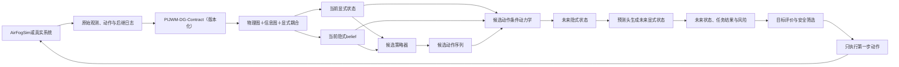

# PI-JWM 理论定义与固定技术规范

> 最后核查日期：2026-08-11 
> 当前文件位置：`文档/知识库/PIJWM主文档.md`；2026-08-15已从原外部知识库迁入PI-JWM仓库，后续只维护本文件。 
> 文档定位：只保存 PI-JWM 已确认的研究问题、系统定义、因果边界、优化与学习目标、方法接口、理论依据、数据规范和实验原则。 
> 进展分工：2026-08-12 起的计划、实现记录、实验结果、失败与修正统一写入同目录的`8.12之后推进.md`，本文件不再保存周报、阶段流水账或R0-R9状态表。 
> 使用原则：理论定义、汇报/PPT、代码、数据、配置、机器产物和结论必须逐项一致。尚未由代码、测试和机器证据实现的内容只能标为目标定义、候选方法或未实现。 
> 更新原则：若现有接口无法实现某项理论要求，只允许补齐实现并验证，或根据数据、接口与证明同步修订理论；不得用同名模块、latent/belief、代理指标或可运行接口冒充完整方法。

> **2026-08-03修订状态：** 按老师“通信相关内容进入信息图”的要求重新固定双图口径。物理图只描述真实硬件实体及其空间、运动和环境关系；无线/有线通信链路、CSI、信道增益、干扰、SINR、RB、速率和吞吐量统一属于信息图。信息图节点为附着于物理设备的通信/计算/服务代理，信息图边为代理之间具有真实端点的通信链路；任务、DAG和数据流作为业务辅助对象，不替代信息节点或通信边。现有AirFogSim原始轨迹、动作日志、数据划分和评价代码可以复用，但2026-08-03之前按“信道属于物理图、信息流作为信息边”训练的模型与结果只保留为过渡语义历史基线，不能作为本修订定义下的正式结果。

## 文档真值规则

本文件中的“固定”表示研究定义和必须满足的接口，不自动表示代码已经完成。每个方法性主张必须同时具有：明确输入输出、对应代码路径、针对性测试、机器可读产物和验收结果。只有名称、流程图、张量形状、模块导入、checkpoint可加载或短时smoke，均不能证明理论方法已经实现。

尤其固定以下判定：策略器读取世界模型的latent或belief，只能称为“belief-conditioned policy”；只有对每个合法候选动作或动作序列实际执行世界模型动作条件rollout，并以预测的未来显式状态、任务结果、系统代价和风险完成比较，才可以称为“基于世界模型候选rollout的规划器”。二者不得混称。

当前已核查但尚未满足本文件目标定义的实现差异统一进入`8.12之后推进.md`作为阻断项。差异关闭前，相关旧结果只能作为阶段接口证据，不得升级为最终方法证据。

## 一、研究场景与核心问题

### 1. 研究场景与系统实体

PI-JWM面向基础设施辅助的动态空地协同移动边缘计算网络。系统由车辆、无人机（UAV）、路侧单元（RSU）和边缘计算节点组成，节点、无线链路、任务以及通信、计算、存储和能量资源均随时间变化。

当前不预设系统为cell-free网络。PI-JWM只要求异构节点之间存在动态可行连接，并允许任务在合法计算节点之间卸载；只有后续数据与协议明确包含多接入点联合服务时，才把cell-free作为具体实验场景。

| 系统实体 | 主要职责 | 在PI-JWM中的角色 |
| --- | --- | --- |
| 车辆 | 产生任务、发送数据、接收结果，可选提供车载计算 | 移动物理节点、任务源和候选计算节点 |
| UAV | 提供空中通信、计算或感知服务 | 移动物理节点、候选通信节点和候选计算节点 |
| RSU | 提供固定接入、转发和边缘计算 | 固定物理节点和基础设施计算节点 |
| 边缘服务器 | 执行任务并维护计算、存储和队列资源 | 可与车辆、UAV或RSU共址的资源拥有者 |
| 云节点 | 在具有真实路径和时延模型时提供远端计算 | 可选计算节点 |
| 逻辑调度器 | 生成候选动作、检查可行性并滚动决策 | PI-JWM的下游使用者，不属于世界模型本体 |

### 2. 网络组织与双图关系

系统采用逻辑集中式、物理异构的控制组织。逻辑集中式只表示调度器能够在一个决策周期内汇总核心观测并比较候选动作，不要求数据永久汇聚到固定RSU，也不排除后续采用分层或分布式实现。

物理图回答“真实设备在哪里、如何运动、具有什么硬件以及彼此具有怎样的空间和环境关系”；信息图回答“设备上的通信/计算/服务代理如何连接、链路状态如何、承载什么数据以及使用哪些通信资源”。无线和有线链路及其信道、协议和传输结果统一进入信息图。任务、DAG和数据流属于业务辅助结构：它们决定链路上是否存在待服务负载，但不替代信息节点或通信链路。卸载动作改变任务的执行代理和输入流目的端，RB动作改变信息链路获得的无线资源；两者都不创建物理实体或物理空间关系。

### 3. 核心控制切片与变量角色

当前核心控制切片固定为任务卸载目标选择和无线RB分配。前者决定任务由哪个合法信息代理承接计算，并据此创建或更新源代理到执行代理的输入流；后者决定待服务数据流在对应信息链路上使用哪些RB。二者共同改变通信服务、计算负载和任务进度，但不改变物理设备及其空间关系。逐任务、逐数据流和逐信息链路动作变量在第二部分统一定义。

CSI、信道增益、路径损耗、SINR、链路可用性和历史链路速率属于信息边状态或观测，不属于动作。CPU硬件容量属于物理设备属性；CPU占用、计算队列和剩余计算量属于信息代理及资源状态。当前CPU分配不作为核心动作，而是在每个卸载与RB候选执行通信更新后，根据候选实际形成的可计算任务集合、任务剩余工作量和节点容量调用同一确定性工作守恒规则。该规则必须在每个候选、每个rollout步真实执行并更新后继状态，不能把CPU写成与候选无关的常量。

| 类型 | 当前处理 |
| --- | --- |
| 核心可控量 | 任务卸载目标、无线RB分配 |
| 外生过程 | 车辆移动、UAV既定运动、任务到达 |
| 随机过程 | 传播、遮挡、快衰落、干扰和执行噪声 |
| 固定机制 | 候选通信后执行的确定性CPU工作守恒规则、功率、MCS、返回路由和协议参数 |
| 可选扩展 | CPU控制、功率控制、UAV轨迹、缓存、切片和mission分配 |

### 4. 适用边界与扩展原则

新动作只有在具有可核验动作日志、真实生效、后果可测、数据支持充分且能够回答新研究问题时才进入扩展版本。扩展只增加动作分量、约束和实验，不改变严格双图、动作条件动力学和规划接口。

系统以离散周期$\Delta t$观测和决策，并在有限时域$K$内评价候选动作后果。$\Delta t$、$K$及不同预测时域属于实验配置；具体数值和执行事实统一记录在《8.12之后推进》的对应实验条目。

本研究不把AirFogSim视为PI-JWM框架，不把调度器视为世界模型，也不把单纯CSI预测或无动作的自然演化预测等同于PI-JWM。只有带有时间对齐的状态、实际动作和后继结果，并能独立执行硬约束与安全回退的场景，才属于当前适用范围。

### 5. PI-JWM研究目标与作用

PI-JWM需要回答的核心问题是：

> 能否根据历史物理—信息观测、已执行动作和当前外生上下文，构造保持严格双图结构的belief，并学习卸载与RB动作条件下的联合动力学，从而可靠预测候选动作对未来物理链路、任务演化和资源状态的影响？

该问题包含四个紧密相连的方面：

1. 分别表示设备—空间关系物理图与代理—通信链路信息图，并通过代理附着、信息边—物理端点对应和流—链路关系进行严格耦合；
2. 区分卸载、RB动作引起的可控变化与移动、业务到达、信道随机性引起的外生变化；
3. 在多步rollout中保持图合法性、任务阶段、资源容量和守恒约束，并输出可校准的不确定性；
4. 检查较好的状态预测能否改善候选动作评价，而不是只降低平均RMSE。

PI-JWM是动作条件世界模型，不是动作生成器、优化器或仿真器。完整闭环中的职责为：

| 模块 | 职责 |
| --- | --- |
| 数据源或真实系统 | 提供时间对齐的状态—动作—结果轨迹 |
| 候选动作生成器 | 提出卸载与RB候选动作 |
| 可行性与安全层 | 排除违反硬约束或超出支持范围的动作 |
| PI-JWM | 预测候选动作对应的未来联合状态、结果与不确定性 |
| 规划器 | 根据预测代价和风险选择动作 |
| 执行环境 | 执行动作并返回新观测 |

研究顺序固定为：先建立可信的联合状态预测，再验证动作排序与决策接口，最后评价闭环系统收益。状态预测、动作排序和系统收益使用不同指标，不能合并成单一链路速率RMSE。

## 二、严格双图联合系统模型

### 1. 时间尺度、因果顺序与变量分类

| 符号 | 严格定义 |
| --- | --- |
| $\mathcal T=\{0,\ldots,T-1\}$ | 离散决策时刻集合，$T$为总步数 |
| $t,\tau\in\mathcal T$ | 当前时刻与历史时刻索引 |
| $H$ | 历史观测窗口长度 |
| $K$ | 多步rollout长度，$k\in\{1,\ldots,K\}$为预测步索引 |
| $\Delta t$ | 相邻决策时刻之间的物理时间 |

时刻$t$使用$\tau\in\{t-H+1,\ldots,t\}$的历史信息预测$t+1$至$t+K$，因此要求$t\ge H-1$且$t+K\le T-1$。集合之间的“$\times$”均表示笛卡尔积，不表示数值乘法。

**（1）因果时序与决策边界。**

| 符号 | 严格定义 |
| --- | --- |
| $\mathbf o_t^{PI}$ | 时刻$t$实际可获得的物理—信息联合观测 |
| $\mathbf h_t$ | 最近$H$步观测及此前已执行动作组成的历史 |
| $\mathcal F_t^{\mathrm{dec}}$ | 选择动作前合法获得的决策信息集 |

$$
\mathbf h_t=
\left(
\mathbf o_{t-H+1:t}^{PI},
\mathbf a_{t-H:t-1}^{\mathrm{core}}
\right),
\qquad
\mathcal F_t^{\mathrm{dec}}
=
\sigma\!\left(
\mathbf h_t,
\mathbf c_{t:t+K-1}^{\mathrm{avail}}
\right).
$$

单步因果顺序固定为

$$
\mathbf o_t^{PI}
\rightarrow
\mathbf h_t
\rightarrow
\mathbf b_t
\rightarrow
\mathbf a_t^{\mathrm{core}}
\rightarrow
\mathbf s_{t+1}^{PI}
\rightarrow
\mathbf o_{t+1}^{PI}.
$$

$\mathbf a_t^{\mathrm{core}}$只能依赖$\mathcal F_t^{\mathrm{dec}}$并作用于$[t,t+1)$。未来真实状态、真实CSI、真实任务到达和动作执行结果只能作为标签，不能进入时刻$t$的输入。不同数据源的内部事件顺序统一在上述决策边界对齐；具体仿真器执行顺序及其核验结果记录在《8.12之后推进》。

**（2）可控量、外生量与随机扰动。**

| 类型 | 符号 | 当前定义 |
| --- | --- | --- |
| 核心动作 | $\mathbf a_t^{\mathrm{core}}$ | 卸载目标选择和无线RB分配 |
| 外生上下文 | $\mathbf c_t$ | 决策时可观测或可因果预测的移动、业务与场景条件 |
| 固定机制 | $\boldsymbol\vartheta^{\mathrm{fix}}$ | CPU规则、固定路由、功率、MCS和协议参数 |
| 随机创新 | $\mathbf w_{t+1}$ | 下一步才揭示的任务到达、快衰落、干扰和执行噪声 |

卸载动作直接改变选定执行代理，RB动作直接改变信息通信边获得的无线资源。队列、任务进度和资源占用是动作后果；移动、任务到达和随机信道不是当前核心动作。完整转移关系在本部分末尾统一定义。

### 2. 观测、显式状态与latent belief

| 符号 | 严格定义 |
| --- | --- |
| $\mathbf s_t^{PI}$ | 理论上足以决定下一步分布的完整严格双图联合状态 |
| $p_O^\star$ | 真实观测模型 |
| $\mathbf o_t^{PI}$ | 由完整状态产生的缺失、带噪或延迟观测 |

$$
\mathbf o_t^{PI}
\sim
p_O^\star\!\left(
\mathbf o_t^{PI}\mid\mathbf s_t^{PI}
\right).
$$

完整状态的Markov要求为

$$
p^\star\!\left(
\mathbf s_{t+1}^{PI}
\mid
\mathbf s_{0:t}^{PI},
\mathbf a_{0:t}^{\mathrm{core}},
\mathbf c_{0:t}
\right)
=
p^\star\!\left(
\mathbf s_{t+1}^{PI}
\mid
\mathbf s_t^{PI},
\mathbf a_t^{\mathrm{core}},
\mathbf c_t
\right).
$$

该等式是完整状态的定义要求，不是现有数据自动满足的结论。单帧$\mathbf o_t^{PI}$通常不满足Markov性，因此PI-JWM使用$\mathbf h_t$而不是把一帧节点—边特征直接当作真实状态。仿真器内部变量只能作为特权监督或审计字段。

**（1）显式状态、latent belief与不确定性。**

| 符号 | 严格定义 |
| --- | --- |
| $\mathbf s_t^{PI,\mathrm{exp}}$ | 由时刻$t$合法观测确定构造的显式双图状态 |
| $\mathcal E^{PI}$ | 观测清洗、掩码、派生和图构造过程 |
| $\mathcal B_t$ | 给定历史后完整状态的理论后验分布 |
| $\mathbf b_t$ | PI-JWM学习得到的有限维latent belief |
| $q_\phi$ | belief推断模型 |
| $\mathcal D_\psi$ | 从隐式状态与规则层结果生成可解释显式状态的分类型预测头集合 |
| $\widehat{\mathbf u}_{t+1:t+K}$ | 概率、协方差、分位数、校准区间和OOD风险等不确定性输出 |

$$
\mathbf s_t^{PI,\mathrm{exp}}
=
\mathcal E^{PI}(\mathbf o_t^{PI}),
\qquad
\mathcal B_t
=
p^\star(\mathbf s_t^{PI}\mid\mathbf h_t),
\qquad
\mathbf b_t
\sim
q_\phi(\mathbf b_t\mid\mathbf h_t).
$$

$\mathbf s_t^{PI,\mathrm{exp}}$只含可追溯的显式字段；$\mathbf b_t$压缩未观测传播、队列和历史动作记忆，不能解释为新的物理传感量。若两段历史得到相同显式状态但具有不同未来分布，就发生状态别名；模型无法消除的歧义必须由$\widehat{\mathbf u}_{t+1:t+K}$表达。

**双状态生成是PI-JWM的固定接口。** 当前时刻同时生成两种状态：显式状态由协议字段直接构造，隐式状态由观测—动作历史推断。未来第$k$步先进行动作条件隐式转移，再由分类型预测头生成对应的未来显式状态：

$$
\mathbf b_t\sim q_\phi(\mathbf b_t\mid\mathbf h_t),
\qquad
\widehat{\mathbf b}_{t+k}^{-}
\sim
p_\theta\!\left(
\widehat{\mathbf b}_{t+k-1}^{-},
\mathbf a_{t+k-1}^{\mathrm{core}},
\widehat{\mathbf s}_{t+k}^{PI,\mathrm{det}}
\right),
$$

$$
\widehat{\mathbf s}_{t+k}^{PI,\mathrm{exp}}
=
\mathcal D_\psi\!\left(
\widehat{\mathbf b}_{t+k}^{-},
\widehat{\mathbf s}_{t+k}^{PI,\mathrm{det}},
\mathbf M_{t+k}^{\mathrm{tar}}
\right).
$$

其中$\mathcal D_\psi$只生成数据协议允许且目标掩码有效的显式字段；阶段、动作写入和守恒量优先保留规则层结果。每个rollout步都同时保留$(\widehat{\mathbf s}_{t+k}^{PI,\mathrm{exp}},\widehat{\mathbf b}_{t+k}^{-})$：前者用于解释、硬约束检查和真实指标，后者用于历史记忆、部分可观测性和继续递归。只输出latent或只复制显式状态都不构成完整PI-JWM状态生成。

文献依据：Kaelbling et al. (1998) 的POMDP状态、观测和belief边界，以及World Models、Dreamer和TD-MPC2的动作条件latent状态建模。

### 3. 物理图定义

时刻$t$的物理图定义为

$$
\mathcal G_t^P=(\mathcal V_t^P,\mathcal E_t^P),
$$

其中节点是真实硬件实体，边是实体之间的空间、运动或环境关系。物理图不再包含无线信道或有线通信链路。

| 对象      | 符号                         | 完整定义                                       |
| ------- | -------------------------- | ------------------------------------------ |
| 车辆节点    | $v_i^{\mathrm{veh}}$       | 真实车辆硬件实体                                   |
| UAV节点   | $v_i^{\mathrm{uav}}$       | 真实无人机硬件实体                                  |
| RSU节点   | $v_i^{\mathrm{rsu}}$       | 真实路侧单元硬件实体                                 |
| 独立MEC节点 | $v_i^{\mathrm{mec}}$       | 与车辆、UAV、RSU不共址时单独建模的边缘服务器；共址时只记录为宿主设备的硬件容量 |
| 云基础设施节点 | $v_i^{\mathrm{cloud}}$     | 仅在数据源提供真实实体、位置或可核验基础设施身份时保留的远端硬件节点         |
| 物理节点集合  | $\mathcal V_t^P$           | 时刻$t$存在且可用的上述真实硬件节点集合                      |
| 物理邻接边   | $e_{ij,t}^P=(v_i^P,v_j^P)$ | 节点$i$到节点$j$的有序空间、运动和环境关系；不表示正在通信或一定能够通信    |
| 物理边集合   | $\mathcal E_t^P$           | 由冻结邻域规则或数据源真实空间关系形成的物理邻接边集合                |

物理节点特征固定为

$$
\mathbf x_{i,t}^{P,N}
=
\left[
\operatorname{onehot}(\kappa_i^P)
\,\|\,
\zeta_{i,t}^P
\,\|\,
\mathbf p_{i,t}^P
\,\|\,
\mathbf v_{i,t}^P
\,\|\,
\boldsymbol\alpha_{i,t}^P
\,\|\,
\psi_{i,t}^P
\,\|\,
E_{i,t}^P
\,\|\,
C_i^{\mathrm{cpu}}
\,\|\,
C_i^{\mathrm{mem}}
\right],
$$

其中$\kappa_i^P$、$\zeta_{i,t}^P$、$\mathbf p_{i,t}^P$、$\mathbf v_{i,t}^P$、$\boldsymbol\alpha_{i,t}^P$、$\psi_{i,t}^P$、$E_{i,t}^P$、$C_i^{\mathrm{cpu}}$和$C_i^{\mathrm{mem}}$依次表示设备类型、存在可用状态、位置、速度、加速度、航向、剩余能量、安装的CPU容量和安装的存储容量。任务队列、CPU分配量和通信队列不写入物理节点特征。

物理边存在规则固定为

$$
\mathcal E_t^P
=
\left\{
(i,j)\mid i\neq j,\ \zeta_{i,t}^P\zeta_{j,t}^P=1,\ r_{ij,t}^P=1
\right\},
$$

其中$r_{ij,t}^P$由版本化数据协议中的邻域半径、$k$近邻或数据源空间关系之一确定，同一数据版本不得混用多种规则。物理边特征为

$$
\mathbf x_{ij,t}^{P,E}
=
\left[
\Delta\mathbf p_{ij,t}^P
\,\|\,
d_{ij,t}^P
\,\|\,
\Delta\mathbf v_{ij,t}^P
\,\|\,
\theta_{ij,t}^P
\,\|\,
\phi_{ij,t}^P
\,\|\,
l_{ij,t}^{\mathrm{LoS}}
\,\|\,
o_{ij,t}^{\mathrm{block}}
\right].
$$

$\Delta\mathbf p_{ij,t}^P$、$d_{ij,t}^P$、$\Delta\mathbf v_{ij,t}^P$、$\theta_{ij,t}^P$、$\phi_{ij,t}^P$、$l_{ij,t}^{\mathrm{LoS}}$和$o_{ij,t}^{\mathrm{block}}$分别表示相对位置、距离、相对速度、方位角、高度角、视距状态和遮挡状态。AirFogSim未提供的LoS或遮挡字段必须使用缺失掩码，不得由零值或距离阈值伪造。

**严格边界。** CSI、信道增益、路径损耗、干扰、噪声、SINR、RB、发射功率、MCS、速率、吞吐量和已服务数据量全部属于信息图通信边，不属于物理图。存在物理边只表示两个实体具有可建模的物理空间关系，不表示通信链路存在、被调度或成功传输。
### 4. 信息图定义

时刻$t$的信息图定义为

$$
\mathcal G_t^I=(\mathcal V_t^I,\mathcal E_t^I),
$$

其中节点是附着在真实设备上的通信、计算或服务代理，边是代理之间具有真实端点的无线或有线通信链路。

| 对象 | 符号 | 完整定义 |
| --- | --- | --- |
| 通信代理 | $u_{i,t}^{\mathrm{comm}}$ | 附着于设备$i$并维护通信接口、链路观测和通信队列的逻辑实体 |
| 计算代理 | $u_{i,t}^{\mathrm{comp}}$ | 附着于设备$i$并维护计算队列、执行状态和CPU分配结果的逻辑实体 |
| 服务代理 | $u_{i,t}^{\mathrm{serv}}$ | 附着于设备$i$并维护任务接收、结果返回、deadline和优先级状态的逻辑实体 |
| 复合信息代理 | $u_i^I$ | 首版实现中将同一设备上的通信、计算和服务代理合并得到的单个信息节点 |
| 信息节点集合 | $\mathcal V_t^I$ | 时刻$t$所有有效通信、计算、服务或复合代理的集合 |
| 通信链路 | $e=(u,v,k)\in\mathcal E_t^I$ | 源代理$u$到目的代理$v$经接口或链路类型$k$形成的有向通信边；同一端点对允许多接口平行边 |
| 数据流 | $f\in\mathcal F_t$ | 具有`flow_id`、源代理、目的代理、类型、总量、剩余量和阶段的业务负载对象；不是信息图通信边本身 |
| 任务图 | $\mathcal H_m^T$ | 任务$m$的子任务与先后依赖辅助图；不作为信息图节点或通信边 |

首版复合代理集合为

$$
\mathcal V_t^I
=
\left\{
u_i^I\mid v_i^P\in\mathcal V_t^P
\right\}.
$$

信息节点特征固定为

$$
\mathbf x_{u_i,t}^{I,N}
=
\left[
\operatorname{Queue}_{i,t}^{\mathrm{unassigned}}
\,\|\,
\operatorname{Queue}_{i,t}^{\mathrm{tx}}
\,\|\,
\operatorname{Backlog}_{i,t}^{\mathrm{cpu}}
\,\|\,
\operatorname{Running}_{i,t}
\,\|\,
\operatorname{Queue}_{i,t}^{\mathrm{return}}
\,\|\,
\operatorname{Summary}_{i,t}^{\mathrm{ddl,pri}}
\right].
$$

每条信息边$e=(u,v,k)$的字段按照决策因果顺序分成三组：

$$
\mathbf x_{e,t}^{I,E}
=
\left[
\mathbf x_{e,t}^{I,\mathrm{pre}}
\,\|\,
\mathbf x_{e,t}^{I,\mathrm{act}}
\,\|\,
\mathbf x_{e,t}^{I,\mathrm{out}}
\right].
$$

| 字段组 | 符号 | 字段 |
| --- | --- | --- |
| 决策前链路状态 | $\mathbf x_{e,t}^{I,\mathrm{pre}}$ | 链路类型、端点、接口可用性、CSI、信道增益、路径损耗、噪声、历史干扰、历史SINR、历史速率 |
| 动作或固定配置 | $\mathbf x_{e,t}^{I,\mathrm{act}}$ | RB分配、发射功率、MCS；当前只有RB属于核心动作，功率和MCS为固定配置 |
| 动作后链路结果 | $\mathbf x_{e,t}^{I,\mathrm{out}}$ | 实际干扰、实际SINR、链路活动、速率、outage、吞吐量、已服务数据量 |

信息边是否存在由真实端点、接口兼容性和数据源可核验链路共同决定，不由当前是否有任务、是否分配RB或本时隙速率是否为零决定。任务卸载、结果回传和DAG依赖释放形成数据流$\mathcal F_t$；数据流通过链路—流关系$\mathbf C_t^{FL}$加载到信息边：

$$
[\mathbf C_t^{FL}]_{f,e}=1
\iff
\text{数据流$f$在时隙$t$由通信链路$e$承载或等待该链路服务}.
$$

因此，信息图的节点和边都具有真实设备代理端点；任务ID只作为数据流标签，DAG边只表达业务依赖。没有数据流时通信链路仍可存在；有待传数据流但没有RB时数据流保持pending且服务量为零。
### 5. 跨图耦合关系

联合系统定义为

$$
\mathcal G_t^{PI}
=
\left(
\mathcal G_t^P,
\mathcal G_t^I,
\mathcal R_t^{IP},
\mathcal R_t^{EP}
\right).
$$

双图只保留两类可核验跨图关系：

| 耦合关系 | 符号 | 严格定义 |
| --- | --- | --- |
| 信息代理—物理设备附着 | $\mathbf C_t^{IP}$ | $[\mathbf C_t^{IP}]_{ui}=1$表示信息代理$u$部署在物理设备$i$上 |
| 信息通信边—物理关系对应 | $\mathbf C_t^{EP}$ | $[\mathbf C_t^{EP}]_{e,(i,j)}=1$表示信息边$e=(u_i,u_j,k)$的端点对应物理节点对$(i,j)$及其空间环境关系 |

首版每个信息代理唯一附着于一个物理设备：

$$
\sum_{i\in\mathcal V_t^P}[\mathbf C_t^{IP}]_{ui}=1.
$$

若信息边$e=(u,v,k)$存在，令$i=\pi_t(u)$、$j=\pi_t(v)$，则其物理端点必须与附着关系一致：

$$
[\mathbf C_t^{EP}]_{e,(i,j)}=1
\Rightarrow
[\mathbf C_t^{IP}]_{ui}=1
\land
[\mathbf C_t^{IP}]_{vj}=1.
$$

构图协议必须保证每条信息通信边都能回指到唯一的有序物理端点对；若信息链路端点之间需要物理上下文而当前邻域规则没有产生$(i,j)$，则该数据版本必须扩充物理邻域，不能由神经网络用全连接attention隐式补造关系。

跨图作用是双向的，但含义不同：

- **物理到信息：** 位置、相对运动、LoS/遮挡、剩余能量和硬件容量为通信链路与服务状态提供条件；
- **信息到物理：** 实际通信、计算与调度结果形成能耗和设备负载反馈，更新下一时隙物理节点状态；
- **业务到信息：** 数据流—链路关系$\mathbf C_t^{FL}$和任务—代理关系$\mathbf C_t^{TI,q}$只属于信息/业务层辅助索引，不是第三类跨图耦合。

旧定义中的“信息流—物理边承载”$\mathbf C_t^{FE}$自2026-08-03起停用。原因是无线信道已经归入信息边，数据流由$\mathbf C_t^{FL}$加载到信息通信边；真正跨越物理图与信息图的是代理附着$\mathbf C_t^{IP}$和信息边端点的物理关系对应$\mathbf C_t^{EP}$。

**文献锚点与定义边界。** Yağan等在IEEE TPDS 2012论文[Optimal Allocation of Interconnecting Links in Cyber-Physical Systems](https://doi.org/10.1109/TPDS.2012.62)中把网络化CPS表示为两个各自具有节点和层内边的交互网络，并用显式跨网络连接/依赖矩阵表示层间关系；这直接支撑“物理图、信息图分别定义，再以$\mathbf C_t^{IP}$和$\mathbf C_t^{EP}$显式耦合”的结构原则，但不直接规定本文物理边必须采用哪一种空间邻域规则。Shen等在IEEE JSAC 2021论文[Graph Neural Networks for Scalable Radio Resource Management](https://doi.org/10.1109/JSAC.2020.3036965)中将无线RRM写成图优化问题，并把信道状态作为无线通信图的边特征；因此PI-JWM将CSI、信道增益、干扰、SINR和速率放在信息通信边，而不再放入物理图。两篇论文都没有原样定义PI-JWM的复合信息代理、任务/DAG辅助结构或动作条件世界模型；这些是面向移动边缘场景的组合实例化，必须继续通过单图/双图、无耦合和打乱耦合关系等消融验证，不能写成文献已经证明的最优划分。

**单时隙因果顺序。** 时刻$t$先使用合法观测构造物理图、决策前信息图、任务/DAG和资源状态，再选择卸载与RB动作；动作在$[t,t+\Delta t)$内执行，产生实际干扰、SINR、速率、数据流服务量、计算服务量和能耗，最后形成$t+1$状态。动作后的结果不得反向进入时刻$t$的决策前图特征。
### 6. 任务生命周期与任务动力学

| 符号 | 严格定义 |
| --- | --- |
| $\mathcal M,\mathcal M_t$，$m,n$ | 全部任务、时刻$t$已到达且未终止的活动任务及其索引 |
| $\mathbf d_m^{M,\mathrm{stat}}$ | 任务类型、到达、输入量、计算量、输出量、deadline和优先级等静态属性 |
| $\ell_{m,t}$，$\mathbf r_{m,t}^{M,\mathrm{rem}}$ | 任务生命周期及输入、计算、输出三类剩余量 |
| $\mathcal H_m^T$，$\Gamma_m^{T,-}$ | 任务$m$的可选子任务DAG及当前子任务的直接前驱集合 |
| $r_{m,t}^{\mathrm{ready}}$ | 任务$m$的全部直接前驱条件是否满足 |
| $\Delta D_{m,t}^{\mathrm{in}}$ | 本时隙真正到达执行节点的输入数据量 |
| $\Delta W_{m,t}^{\mathrm{cpu}}$ | 本时隙完成的计算工作量 |
| $\Delta D_{m,t}^{\mathrm{out}}$ | 本时隙真正到达结果接收节点的输出数据量 |
| $\Delta D_{mn,t}^{\mathrm{dep}}$ | 本时隙真正到达后继任务承载节点的依赖数据量 |

$$
r_{m,t}^{\mathrm{ready}}
=
\prod_{n\in\Gamma_m^{T,-}}
\sigma_{nm,t}^T,
$$

空前驱集合采用空乘积$r_{m,t}^{\mathrm{ready}}=1$。三类任务剩余量统一更新为

$$
\mathbf r_{m,t+1}^{M,\mathrm{rem}}
=
\left[
\mathbf r_{m,t}^{M,\mathrm{rem}}
-
\begin{bmatrix}
\Delta D_{m,t}^{\mathrm{in}}\\
\Delta W_{m,t}^{\mathrm{cpu}}\\
\Delta D_{m,t}^{\mathrm{out}}
\end{bmatrix}
\right]^+,
$$

若$\mathcal H_m^T$包含跨代理依赖，依赖数据对应的信息流$f_{nm}$按统一信息流剩余量更新：

$$
D_{f_{nm},t+1}^{\mathrm{rem}}
=
\left[
D_{f_{nm},t}^{\mathrm{rem}}
-
\Delta D_{mn,t}^{\mathrm{dep}}
\right]^+.
$$

生命周期顺序为等待/就绪、输入传输、计算、结果回传、完成或失败。每个服务增量只统计端到端真正推进任务阶段的量，不能把多跳路径各跳数据量相加后重复计数。阶段合法性、deadline和失败条件作为确定性更新规则进入本部分末尾的动作条件转移。

### 7. 资源状态

| 符号 | 严格定义 |
| --- | --- |
| $\mathcal B$，$b\in\mathcal B$ | 无线RB集合及索引 |
| $\bar F_i,F_{i,t}^{\mathrm{use}},F_{i,t}^{\mathrm{rem}}$ | 节点CPU容量、占用量和剩余量 |
| $\bar S_i,S_{i,t}^{\mathrm{use}},S_{i,t}^{\mathrm{rem}}$ | 节点存储容量、占用量和剩余量 |
| $E_i^{\max},E_{i,t},\Delta E_{i,t}$ | 最大能量、剩余能量和时隙能耗 |
| $L_{b,t}^{\mathrm{RB}}$ | RB $b$上的活动传输数 |
| $\mathbf S_t^R$ | 完整资源状态 |

$$
F_{i,t}^{\mathrm{rem}}=\bar F_i-F_{i,t}^{\mathrm{use}},
\qquad
S_{i,t}^{\mathrm{rem}}=\bar S_i-S_{i,t}^{\mathrm{use}},
\qquad
E_{i,t+1}=[E_{i,t}-\Delta E_{i,t}]^+,
$$

并满足

$$
0\le F_{i,t}^{\mathrm{use}}\le\bar F_i,
\qquad
0\le S_{i,t}^{\mathrm{use}}\le\bar S_i,
\qquad
0\le E_{i,t}\le E_i^{\max}.
$$

$$
L_{b,t}^{\mathrm{RB}}
=
\sum_{f\in\mathcal F_t}
\sum_{e\in\mathcal E_t^{I,W}}
a_{f,e,b,t}^{\mathrm{RB}}.
$$

$L_{b,t}^{\mathrm{RB}}>1$表示空间复用，需要计算同频干扰，不预设全局正交。节点不适用的存储或能量分量使用掩码，未知容量不能写成零容量。

$$
\mathbf S_t^R
=
\left(
\{(\bar F_i,F_{i,t}^{\mathrm{use}},F_{i,t}^{\mathrm{rem}},
\bar S_i,S_{i,t}^{\mathrm{use}},S_{i,t}^{\mathrm{rem}},
E_i^{\max},E_{i,t})\}_{i\in\mathcal N},
\{L_{b,t}^{\mathrm{RB}}\}_{b\in\mathcal B}
\right).
$$

资源状态附着于物理节点或全局RB池，不构成第三张图。

### 8. 联合调度动作

| 符号 | 严格定义 |
| --- | --- |
| $\mathcal M_t^{\mathrm{off}}$ | 等待选择执行代理的任务集合 |
| $a_{mi,t}^{\mathrm{off}}$ | 是否为任务$m$选择物理设备$i$上的计算代理执行 |
| $a_{f,e,b,t}^{\mathrm{RB}}$ | 是否给数据流$f$在信息通信边$e$上分配RB $b$ |
| $\mathbf a_t^{\mathrm{core}}$ | 当前核心联合动作$\left(\mathbf a_t^{\mathrm{off}},\mathbf a_t^{\mathrm{RB}}\right)$ |
| $\mathbb A_t^{\mathrm{feas}}$ | 满足阶段、信息链路和资源硬约束的核心动作可行域 |
| $\mu_{\mathrm{wc}}^{\mathrm{cpu}}$，$f_{mi,t}^{\mathrm{cpu}}$ | 候选通信后执行的确定性CPU工作守恒规则及其服务率输出 |
| $y_{e,b,t}^{\mathrm{tx}}$ | 信息通信边$e$在RB $b$上是否存在活动传输 |
| $\Delta D_{f,e,t}^{\mathrm{tx}}$ | 数据流$f$在信息通信边$e$上获得的传输服务量 |

$$
\mathbf a_t^{\mathrm{core}}
=
\left(
\mathbf a_t^{\mathrm{off}},
\mathbf a_t^{\mathrm{RB}}
\right)
\in
\mathbb A_t^{\mathrm{feas}},
\qquad
\sum_{i\in\mathcal V_t^P}a_{mi,t}^{\mathrm{off}}=1.
$$

卸载动作写入任务—代理关系$q^{\mathrm{exec}}$，并在远端执行时创建或更新输入数据流；数据到达执行代理前不改变$q^{\mathrm{host}}$。RB动作只能服务已有数据流与已有信息通信边：

$$
a_{f,e,b,t}^{\mathrm{RB}}
\le
[\mathbf C_t^{FL}]_{f,e},
\qquad
f\in\mathcal F_t, e\in\mathcal E_t^I.
$$

信息链路活动、SINR、速率和服务量为

$$
y_{e,b,t}^{\mathrm{tx}}
=
\mathbb I\!\left[
\sum_{f\in\mathcal F_t}a_{f,e,b,t}^{\mathrm{RB}}>0
\right],
$$

$$
\gamma_{e,b,t}
=
\frac{P_{e,b,t}g_{e,t}^{I}}
{N_0+\sum_{e'\neq e}y_{e',b,t}^{\mathrm{tx}}P_{e',b,t}g_{e'\rightarrow d(e),t}^{I}},
\qquad
R_{e,b,t}=B_{\mathrm{RB}}\log_2(1+\gamma_{e,b,t}),
$$

$$
\Delta D_{f,e,t}^{\mathrm{tx}}
=
\Delta t
\sum_{b\in\mathcal B}
a_{f,e,b,t}^{\mathrm{RB}}R_{e,b,t}.
$$

$g_{e,t}^{I}$和$g_{e'\rightarrow d(e),t}^{I}$分别表示目标信息边信道增益和并发信息边到目标接收端的干扰信道增益，均属于信息边状态。服务量先扣减数据流剩余量，再按流类型更新任务输入、依赖或结果状态。CPU不属于当前核心动作，但必须对每个候选通信后状态分别执行。令$\widetilde{\mathbf s}_{t}^{\mathrm{post\text{-}comm}}$表示应用候选卸载和RB动作并完成本时隙通信更新后的状态，则

$$
\mathbf f_t^{\mathrm{cpu}}
=
\mu_{\mathrm{wc}}^{\mathrm{cpu}}
\left(
\widetilde{\mathbf s}_{t}^{\mathrm{post\text{-}comm}};
\boldsymbol\vartheta_{\mathrm{cpu}}^{\mathrm{fix}}
\right),
\qquad
0\le f_{mi,t}^{\mathrm{cpu}}\le\frac{W_{m,t}^{\mathrm{rem}}}{\Delta t},
\qquad
\sum_m f_{mi,t}^{\mathrm{cpu}}\le\bar F_i.
$$

规则采用封顶均分的工作守恒分配：节点有未满足计算需求且总需求不小于容量时，分配总量等于节点容量；需求较小的任务先按剩余工作量封顶，剩余容量再确定性重分配。CPU规则不读取未来状态、未来结果、deadline、priority或策略输出，没有可训练权重。CPU控制、功率、MCS、UAV轨迹、返回路由、缓存和mission只作为后续扩展，不在当前动作空间中。
### 9. 联合状态与动作条件转移

完整联合状态同时保留显式双图、业务对象、资源状态和跨图关系：

$$
\mathbf s_t^{PI}
=
\Big(
\mathbf A_t^P,
\mathbf X_t^{P,N},
\mathbf X_t^{P,E},
\mathbf A_t^I,
\mathbf X_t^{I,N},
\mathbf X_t^{I,E},
\mathbf X_t^{F},
\mathbf C_t^{IP},
\mathbf C_t^{EP},
\mathbf C_t^{FL},
\mathbf S_t^T,
\mathbf S_t^R
\Big).
$$

其中$\mathbf X_t^{P,N}$、$\mathbf X_t^{P,E}$编码物理实体及空间关系，$\mathbf X_t^{I,N}$、$\mathbf X_t^{I,E}$编码信息代理及通信链路，$\mathbf X_t^F$编码数据流，$\mathbf S_t^T$和$\mathbf S_t^R$分别编码任务/DAG和资源状态。动态节点、通信边、数据流和任务均带存在掩码；补零只用于批处理。

真实系统满足

$$
\mathbf s_{t+1}^{PI}
=
F^\star
\left(
\mathbf s_t^{PI},
\mathbf a_t^{\mathrm{core}},
\mathbf c_t,
\boldsymbol\vartheta^{\mathrm{fix}},
\mathbf w_{t+1}
\right).
$$

可由规则唯一确定的阶段、动作写入和守恒量先经$\mathcal U^{\mathrm{det}}$更新；无法精确计算的信道、服务、队列、能耗与到达扰动由PI-JWM学习：

$$
\mathbf s_{t+1}^{PI,\mathrm{det}}
=
\mathcal U^{\mathrm{det}}
\left(
\mathbf s_t^{PI,\mathrm{exp}},
\mathbf a_t^{\mathrm{core}},
\mathbf c_t;
\boldsymbol\vartheta^{\mathrm{fix}}
\right),
$$

$$
\mathbf b_{t+1}^{-}
\sim
p_\theta
\left(
\mathbf b_{t+1}^{-}
\mid
\mathbf b_t,
\mathbf a_t^{\mathrm{core}},
\mathbf c_t,
\mathbf s_{t+1}^{PI,\mathrm{det}}
\right).
$$

部署时只使用观测—动作历史$\mathbf h_t$推断当前belief，不读取未来真实CSI、任务到达或动作结果。显式状态用于约束、评价与解释，latent belief用于处理部分可观测性和递归预测，两者不能互相替代。
## 三、优化问题与学习目标

### 1. 决策变量与可行域

在每个决策时刻$t$，系统只优化第二部分已经定义的核心联合动作$\mathbf a_t^{\mathrm{core}}$。它由任务卸载目标选择和无线RB分配组成：

| 决策分量 | 作用对象 | 决定的内容 |
| --- | --- | --- |
| $\mathbf a_t^{\mathrm{off}}$ | 等待卸载的任务与候选物理节点 | 每个任务选择哪个合法节点作为执行节点 |
| $\mathbf a_t^{\mathrm{RB}}$ | 实际待服务数据流、信息通信边与RB | 哪条数据流在相应信息边上使用哪些RB |
| $\mathbf a_t^{\mathrm{core}}=(\mathbf a_t^{\mathrm{off}},\mathbf a_t^{\mathrm{RB}})$ | 当前核心控制切片 | 时刻$t$实际需要求解的联合动作 |

两个动作分量沿用第二部分的逐元素变量。其完整索引形式为

$$
\mathbf a_t^{\mathrm{off}}
:=
\left\{
a_{mi,t}^{\mathrm{off}}
\right\}_{
m\in\mathcal M_t^{\mathrm{off}},\,
i\in\mathcal N
},
$$

$$
\mathbf a_t^{\mathrm{RB}}
:=
\left\{
a_{f,e,b,t}^{\mathrm{RB}}
\right\}_{
f\in\mathcal F_t,\,
e\in\mathcal E_t^{I,W},\,
b\in\mathcal B
}.
$$

上述逐元素动作均为二元变量：

$$
a_{mi,t}^{\mathrm{off}},
\quad
a_{f,e,b,t}^{\mathrm{RB}}
\in
\{0,1\}.
$$

由这些二元变量组成、但尚未检查系统约束的集合称为原始核心动作空间：

$$
\mathbb A_t^{\mathrm{raw}}
:=
\left\{
\mathbf a_t^{\mathrm{core}}
\mid
a_{mi,t}^{\mathrm{off}},
a_{f,e,b,t}^{\mathrm{RB}}
\in\{0,1\}
\right\}.
$$

原始动作空间中的组合不一定能够执行。例如，一个动作可能把任务分配给不可用节点、在不存在的信息通信边上分配RB、违反任务阶段，或者超过资源容量。因此，引入非负的硬约束违反向量

$$
\boldsymbol\delta_t^{\mathrm{hard}}
\left(
\mathbf s_t^{PI,\mathrm{exp}},
\mathbf a_t^{\mathrm{core}}
\right)
\in
\mathbb R_{\ge0}^{J_H},
$$

其中，$J_H$为硬约束检查项数量；每个分量等于$0$表示对应硬约束得到满足，大于$0$表示发生违反。当前状态下的核心动作可行域严格定义为

$$
\mathbb A_t^{\mathrm{feas}}
:=
\left\{
\mathbf a_t^{\mathrm{core}}
\in
\mathbb A_t^{\mathrm{raw}}
\ \middle|\ {}
\boldsymbol\delta_t^{\mathrm{hard}}
\left(
\mathbf s_t^{PI,\mathrm{exp}},
\mathbf a_t^{\mathrm{core}}
\right)
=
\mathbf 0
\right\}.
$$

因此，时刻$t$允许被执行的动作必须满足

$$
\mathbf a_t^{\mathrm{core}}
\in
\mathbb A_t^{\mathrm{feas}},
$$

而不是从$\mathbb A_t^{\mathrm{raw}}$中任意选择动作。$\boldsymbol\delta_t^{\mathrm{hard}}$的各个分量将在本部分第3节逐项展开；软约束不决定动作是否属于可行域，而是在第4节进入代价或风险项。

CPU分配、发射功率、MCS、车辆移动、当前固定的UAV运动、任务到达、返回路由、缓存和mission分配均不是当前决策变量；这些量分别按照第二部分的分类作为固定机制、外生过程或随机过程进入状态转移。CPU虽不是动作，但其确定性工作守恒规则必须在候选卸载与RB通信更新后、计算状态更新前执行，并对不同候选分别产生输出。当前正式决策变量只有卸载与RB分配，后续扩展动作必须重新定义动作空间、可行域和对应实验，不能直接混入$\mathbf a_t^{\mathrm{core}}$。

本节定义的是单个决策时刻真正执行的动作。是否在规划器中同时构造未来$K$步候选动作序列，属于第四部分的规划方法，不在此处把它增加为新的系统决策变量。

### 2. 系统最终优化目标

系统最终要优化的不是链路速率预测误差，而是核心调度动作长期作用后的**任务服务质量与资源效率**。单个时刻执行的决策变量是$\mathbf a_t^{\mathrm{core}}$，但任务完成和端到端时延由多个时刻连续累积形成，因此最终目标以调度策略为优化对象。

定义可行调度策略

$$
\pi
:=
\{\pi_t\}_{t\in\mathcal T},
\qquad
\mathbf a_t^{\mathrm{core}}
=
\pi_t
\left(
\mathbf h_t
\right)
\in
\mathbb A_t^{\mathrm{feas}},
$$

并令$\Pi^{\mathrm{feas}}$表示所有满足上述因果边界和动作可行域要求的策略集合。这里的$\pi$不是PI-JWM本体，而是使用PI-JWM预测结果进行调度的策略或规划器。

为避免仿真结束造成右删失，只在结果可判定的任务集合$\mathcal M^{\mathrm{eval}}$上计算系统目标。$\mathcal M^{\mathrm{eval}}$只包含已经完成、已经失败，或者其deadline已经落在观测窗口内的任务。每个有效评价轨迹必须满足$|\mathcal M^{\mathrm{eval}}|>0$；若该集合为空，则该轨迹不计算任务级目标，不能把目标值记为$0$。对任意$m\in\mathcal M^{\mathrm{eval}}$，定义

| 符号 | 严格定义 |
| --- | --- |
| $\omega_m^{\mathrm{pri}}>0$ | 任务$m$的优先级权重 |
| $t_m^{\mathrm{term}}$ | 任务成功时取完成时刻，明确失败时取失败判定时刻；若任务在deadline后仍未终止，则取$t_m^{\mathrm{ddl}}$作为评价截断时刻 |
| $t_m^{\mathrm{ddl}}$ | 任务$m$的绝对deadline时刻 |
| $T_m^{\mathrm{e2e}}:=t_m^{\mathrm{term}}-t_m^{\mathrm{arr}}$ | 任务端到端时延 |
| $I_m^{\mathrm{on}}$ | 任务是否在deadline前成功完成的指示量 |
| $\widetilde T_m\in[0,1]$ | 任务归一化有效时延 |

按时完成指示量定义为

$$
I_m^{\mathrm{on}}
:=
\mathbb I
\left[
\ell_{m,t_m^{\mathrm{term}}}=\mathrm{完成}
\ \land\ {}
t_m^{\mathrm{term}}\le t_m^{\mathrm{ddl}}
\right].
$$

未按时完成的任务不能通过“没有完成时延”逃避时延代价，因此定义

$$
\widetilde T_m
:=
\begin{cases}
\min\!\left\{
\dfrac{T_m^{\mathrm{e2e}}}
{t_m^{\mathrm{ddl}}-t_m^{\mathrm{arr}}},
1
\right\},
& \ell_{m,t_m^{\mathrm{term}}}=\mathrm{完成},\\[8pt]
1,
& \text{任务失败或未在deadline前完成}.
\end{cases}
$$

系统中的移动、信道、任务到达及其他外生随机过程共同记为$\xi$。以下先定义给定策略$\pi$和一次外生实现$\xi$时的轨迹级代价$\widehat J_q(\pi;\xi)$，再对策略诱导的轨迹分布取期望，得到用于优化的系统代价$J_q(\pi)$。

系统目标由五个分量构成。

**（1）任务服务损失。** 首要目标是提高带优先级的按时任务完成率：

$$
\widehat J_{\mathrm{cmp}}(\pi;\xi)
:=
1-
\frac{
\sum_{m\in\mathcal M^{\mathrm{eval}}}
\omega_m^{\mathrm{pri}}I_m^{\mathrm{on}}
}{
\sum_{m\in\mathcal M^{\mathrm{eval}}}
\omega_m^{\mathrm{pri}}
}.
$$

$\widehat J_{\mathrm{cmp}}=0$表示该评价轨迹中的所有被评价任务均按时完成；数值越大表示未按时完成的加权任务比例越高。任务失败和deadline违反将在本部分第7节作为不同评价指标分别报告，但在最终优化目标中统一表现为按时服务损失。

**（2）时延代价。** 在完成能力相近时，进一步降低任务端到端时延：

$$
\widehat J_{\mathrm{lat}}(\pi;\xi)
:=
\frac{
\sum_{m\in\mathcal M^{\mathrm{eval}}}
\omega_m^{\mathrm{pri}}\widetilde T_m
}{
\sum_{m\in\mathcal M^{\mathrm{eval}}}
\omega_m^{\mathrm{pri}}
}.
$$

**（3）能量代价。** 令$\mathcal N^E\subseteq\mathcal N$为具有可用能量字段的物理节点集合，$E^{\mathrm{ref}}>0$为事先固定的参考能量，则

$$
\widehat J_{\mathrm{ene}}(\pi;\xi)
:=
\frac{
\sum_{t\in\mathcal T}
\sum_{i\in\mathcal N^E}
\Delta E_{i,t}
}{
E^{\mathrm{ref}}
}.
$$

只有真实存在且可审计的能量字段才能进入该项；不存在的车辆、RSU或任务能耗不能用零值代替。若某组数据无法形成可比较的能量代价，则该组实验只能标记为“部分目标验证”，并从该实验的优化式中删除能量项，而不是填入伪造的零值后声称完成了全目标评价。

**（4）资源消耗代价。** 分别统计RB时隙占用量和CPU占用量：

$$
C_{\mathrm{RB}}(\pi)
:=
\frac{
\sum_{t\in\mathcal T}
\sum_{b\in\mathcal B}
L_{b,t}^{\mathrm{RB}}
}{
C_{\mathrm{RB}}^{\mathrm{ref}}
},
\qquad
C_{\mathrm{CPU}}(\pi)
:=
\frac{
\sum_{t\in\mathcal T}
\sum_{i\in\mathcal N^F}
F_{i,t}^{\mathrm{use}}\Delta t
}{
C_{\mathrm{CPU}}^{\mathrm{ref}}
},
$$

其中，$\mathcal N^F\subseteq\mathcal N$为具有计算资源的节点集合，$C_{\mathrm{RB}}^{\mathrm{ref}},C_{\mathrm{CPU}}^{\mathrm{ref}}>0$为固定归一化基准。资源消耗代价为

$$
\widehat J_{\mathrm{res}}(\pi;\xi)
:=
\eta_{\mathrm{RB}}C_{\mathrm{RB}}(\pi)
+
\eta_{\mathrm{CPU}}C_{\mathrm{CPU}}(\pi),
\qquad
\eta_{\mathrm{RB}},\eta_{\mathrm{CPU}}\ge0,
\quad
\eta_{\mathrm{RB}}+\eta_{\mathrm{CPU}}=1.
$$

该项表示在相近任务服务水平下减少不必要的资源占用，不表示单独追求低利用率。

**（5）服务公平性代价。** 对每个物理节点$i$，先定义其在当前评价轨迹中产生的任务集合

$$
\mathcal M_i^{\mathrm{eval}}
:=
\left\{
m\in\mathcal M^{\mathrm{eval}}
\ \middle|\ {}
\sum_{u\in\mathcal V_{t_m^{\mathrm{arr}}}^I}
\mu_{mu,t_m^{\mathrm{arr}}}^{q^{\mathrm{src}}}
[\mathbf C_{t_m^{\mathrm{arr}}}^{IP}]_{ui}=1
\right\},
$$

并令$\mathcal N^{\mathrm{src}}:=\{i\in\mathcal N\mid |\mathcal M_i^{\mathrm{eval}}|>0\}$。源节点$i$的带权按时完成率严格定义为

$$
\mathrm{TCR}_i
:=
\frac{
\sum_{m\in\mathcal M_i^{\mathrm{eval}}}
\omega_m^{\mathrm{pri}}I_m^{\mathrm{on}}
}{
\sum_{m\in\mathcal M_i^{\mathrm{eval}}}
\omega_m^{\mathrm{pri}}
}.
$$

采用Jain公平指数的补量定义轨迹级服务公平性代价：

$$
\widehat J_{\mathrm{fair}}(\pi;\xi)
:=
1-
\frac{
\left(
\sum_{i\in\mathcal N^{\mathrm{src}}}
\mathrm{TCR}_i
\right)^2
}{
|\mathcal N^{\mathrm{src}}|
\sum_{i\in\mathcal N^{\mathrm{src}}}
\mathrm{TCR}_i^2
}.
$$

$\widehat J_{\mathrm{fair}}=0$表示该评价轨迹中各任务源具有相同的按时完成率；当所有$\mathrm{TCR}_i$均为$0$时，约定$\widehat J_{\mathrm{fair}}=1$，避免Jain指数出现$0/0$且不把“所有源均未完成任务”误判为公平服务。

对每个具有可靠原始字段的$q\in\{\mathrm{cmp},\mathrm{lat},\mathrm{ene},\mathrm{res},\mathrm{fair}\}$，系统优化使用的策略级代价定义为

$$
J_q(\pi)
:=
\mathbb E_{\xi\sim P^{\pi}}
\left[
\widehat J_q(\pi;\xi)
\right],
$$

其中$P^{\pi}$表示执行策略$\pi$后由系统动力学与外生随机过程共同诱导的轨迹分布。正式实验以多个独立seed或真实轨迹上的样本均值及置信区间估计该期望，不能用单次有利轨迹代替策略表现。

五个目标不能在未归一化时直接相加，也不能让节省能量或资源的收益抵消大量任务失败。因此采用**两层优化**。

第一层先求可行策略能够达到的最小任务服务损失：

$$
J_{\mathrm{cmp}}^{\star}
:=
\min_{\pi\in\Pi^{\mathrm{feas}}}
J_{\mathrm{cmp}}(\pi).
$$

给定允许的服务损失容差$\epsilon_{\mathrm{svc}}\ge0$，只保留完成能力接近最优的策略：

$$
\Pi_{\epsilon}^{\mathrm{svc}}
:=
\left\{
\pi\in\Pi^{\mathrm{feas}}
\ \middle|\ {}
J_{\mathrm{cmp}}(\pi)
\le
J_{\mathrm{cmp}}^{\star}
+
\epsilon_{\mathrm{svc}}
\right\}.
$$

第二层在该集合内优化归一化时延、能量、资源与公平性：

$$
J_{\mathrm{sec}}(\pi)
:=
\lambda_{\mathrm{lat}}J_{\mathrm{lat}}(\pi)
+
\lambda_{\mathrm{ene}}J_{\mathrm{ene}}(\pi)
+
\lambda_{\mathrm{res}}J_{\mathrm{res}}(\pi)
+
\lambda_{\mathrm{fair}}J_{\mathrm{fair}}(\pi),
$$

$$
\lambda_q\ge0,
\qquad
\sum_{q\in\{\mathrm{lat},\mathrm{ene},\mathrm{res},\mathrm{fair}\}}
\lambda_q=1,
$$

不启用额外SLA时，基础系统优化问题定义为

$$
\boxed{
\pi^{\star}
\in
\arg\min_{
\pi\in\Pi_{\epsilon}^{\mathrm{svc}}
}
J_{\mathrm{sec}}(\pi)
}.
$$

因此，当前课题最终希望达到的效果是：所有动作始终满足硬约束，尽可能多的高优先级任务在deadline前完成；在按时完成能力基本不下降的前提下，进一步降低端到端时延、能量和资源消耗，并减少不同任务源之间的服务差异。

$E^{\mathrm{ref}}$、$C_{\mathrm{RB}}^{\mathrm{ref}}$、$C_{\mathrm{CPU}}^{\mathrm{ref}}$、$\epsilon_{\mathrm{svc}}$和四个$\lambda_q$必须在正式实验前由训练/验证数据或明确的SLA固定，不能根据锁定测试集反复调整。各目标分量必须分别报告，不能只报告最终加权和。

该系统目标用于评价和选择调度策略，不是PI-JWM的训练损失。PI-JWM需要学习的是候选动作作用下的未来状态与结果分布；如何由预测结果近似上述系统目标，放在第5、6节继续定义。

### 3. 硬约束

硬约束表示系统在任何时刻都不允许违反的物理、协议和逻辑规则。硬约束不能依靠增加损失权重来“尽量满足”，而必须由动作掩码、可行域求解器或执行前安全检查严格保证。PI-JWM可以预测候选动作的后果，但不能用预测值覆盖当前可直接验证的硬约束。

**（1）因果性与变量取值。** 动作必须关于决策信息集$\mathcal F_t^{\mathrm{dec}}$可测，即动作只能使用选择动作前合法获得的信息：

$$
\mathbf a_t^{\mathrm{core}}
\text{是}
\mathcal F_t^{\mathrm{dec}}
\text{-可测的},
$$

并且所有逐元素卸载与RB动作都必须保持第二部分规定的二元取值。未来真实CSI、未来任务到达、未来状态和动作执行结果不得进入当前动作。

**（2）卸载唯一性与执行节点合法性。** 令$\chi_{mi,t}^{\mathrm{off}}\in\{0,1\}$表示由当前显式状态和固定协议确定的任务—节点兼容性；它检查节点是否存在、是否具有计算能力以及是否支持任务$m$所需的服务类型。合法候选执行节点集合为

$$
\mathcal N_{m,t}^{\mathrm{off}}
:=
\left\{
i\in\mathcal N
\ \middle|\ {}
\zeta_{i,t}^P=1,
\ \bar F_i>0,
\ \chi_{mi,t}^{\mathrm{off}}=1
\right\}.
$$

每个等待卸载的任务必须且只能选择一个合法执行节点：

$$
\sum_{i\in\mathcal N}a_{mi,t}^{\mathrm{off}}=1,
\qquad
a_{mi,t}^{\mathrm{off}}
\le
\mathbb I\!\left[i\in\mathcal N_{m,t}^{\mathrm{off}}\right],
\qquad
m\in\mathcal M_t^{\mathrm{off}}.
$$

该约束只决定执行节点，不把CPU分配变成新的动作；CPU仍由候选通信后执行的固定规则$\mu_{\mathrm{wc}}^{\mathrm{cpu}}$产生。

**（3）流—信息链路一致性与路径连续性。** 对任意获得服务的数据流$f\in\mathcal F_t$，其源、目的代理由业务状态确定。令$\beta_{f,e,t}\in\{0,1\}$表示数据流$f$是否使用信息通信边$e$，则选中链路必须在信息图上构成从$s(f)$到$d(f)$的有向简单路径：

$$
\Pi_{f,t}^{I}
:=
\left\{
e\in\mathcal E_t^I\mid\beta_{f,e,t}=1
\right\}
\in
\mathcal P_{s(f),d(f),t}^{I}.
$$

AirFogSim当前首版通常为单跳，此时$\Pi_{f,t}^{I}$只含一条端点一致的通信边。pending数据流允许暂时没有可服务链路，但一旦分配RB并声明获得服务，就必须满足链路端点、方向和路径连续性。$\mathbf C_t^{EP}$只用于把通信边回指到物理端点及空间关系，不承担业务路由。

令无线信息边集合为

$$
\mathcal E_t^{I,W}
:=
\left\{
e\in\mathcal E_t^I\mid\lambda_e^I=\mathrm{wireless}
\right\}.
$$

RB只能分配给无线信息边及其已有数据流：

$$
a_{f,e,b,t}^{\mathrm{RB}}
\le
\mathbb I[e\in\mathcal E_t^{I,W}]
[\mathbf C_t^{FL}]_{f,e}.
$$

**（4）RB容量、冲突与链路可解码性。** 同一信息边的同一RB在一个时隙内至多服务一条数据流：

$$
\sum_{f\in\mathcal F_t}a_{f,e,b,t}^{\mathrm{RB}}\le1,
\qquad
e\in\mathcal E_t^{I,W},\ b\in\mathcal B.
$$

令$\mathcal C_{b,t}^{\mathrm{RB}}\subseteq\mathcal E_t^{I,W}\times\mathcal E_t^{I,W}$为协议给定的冲突信息边对集合，则冲突边不能同时激活：

$$
y_{e,b,t}^{\mathrm{tx}}+y_{e',b,t}^{\mathrm{tx}}\le1,
\qquad
(e,e')\in\mathcal C_{b,t}^{\mathrm{RB}}.
$$

不属于冲突集合的链路允许空间复用，但同频干扰必须进入信息边SINR。若固定PHY/MCS给出最小解码阈值$\underline\gamma_{e,b}$，则活动传输还必须满足$\gamma_{e,b,t}\ge\underline\gamma_{e,b}$。
**（5）计算、存储与能量容量。** 当前CPU服务率虽然由固定机制产生，但仍必须满足容量限制；动作作用后的存储和能量状态也不能越界：

$$
0
\le
\sum_{m\in\mathcal M_t}f_{mi,t}^{\mathrm{cpu}}
\le
\bar F_i,
$$

$$
0
\le
S_{i,t}^{\mathrm{use}}
\le
\bar S_i,
\qquad
0
\le
\Delta E_{i,t}
\le
E_{i,t}
\le
E_i^{\max}.
$$

这些约束只应用于具有相应有效字段的节点；字段未知必须使用掩码并标记为不可审计，不能把未知容量记为$0$。任何会使确定性下一状态超过容量的动作都不属于$\mathbb A_t^{\mathrm{feas}}$。

**（6）任务阶段、前驱关系与守恒。** 令

$$
\boldsymbol\nu_{m,t}^{\mathrm{stage}}
:=
\left[
\nu_{m,t}^{\mathrm{in}},
\nu_{m,t}^{\mathrm{cpu}},
\nu_{m,t}^{\mathrm{out}}
\right]
\in\{0,1\}^3
$$

表示由$\ell_{m,t}$和固定生命周期规则确定的输入传输、计算与结果回传服务资格，并令$\nu_{mn,t}^{\mathrm{dep}}\in\{0,1\}$表示依赖流$(m,n)$当前是否允许传输。一个时隙内的有效服务增量必须满足

$$
\mathbf 0
\le
\begin{bmatrix}
\Delta D_{m,t}^{\mathrm{in}}\\
\Delta W_{m,t}^{\mathrm{cpu}}\\
\Delta D_{m,t}^{\mathrm{out}}
\end{bmatrix}
\le
\mathbf r_{m,t}^{M,\mathrm{rem}}
\odot
\boldsymbol\nu_{m,t}^{\mathrm{stage}},
$$

$$
0
\le
\Delta D_{mn,t}^{\mathrm{dep}}
\le
D_{mn,t}^{\mathrm{dep,rem}}
\nu_{mn,t}^{\mathrm{dep}}.
$$

其中$\odot$表示逐元素乘法。任务进入输入或计算阶段前必须满足直接前驱条件：

$$
\nu_{m,t}^{\mathrm{in}}
\le
r_{m,t}^{\mathrm{ready}},
\qquad
\nu_{m,t}^{\mathrm{cpu}}
\le
r_{m,t}^{\mathrm{ready}}.
$$

服务增量必须按照第二部分的剩余量等式更新，不能产生负剩余量、跳过生命周期阶段，也不能把多跳路径每一跳的传输量重复计入端到端任务进度。deadline时间戳和完成判定规则是硬逻辑：未真实完成的任务不能标记为完成，deadline之后完成的任务不能回溯记为按时完成；但“任务一定在deadline前完成”本身属于下一节的软服务要求，因为在随机信道和过载条件下它不一定始终可行。

**（7）硬约束违反向量。** 将上述所有不等式统一写为$g_j^H(\mathbf s_t^{PI,\mathrm{exp}},\mathbf a_t^{\mathrm{core}})\le0$，所有等式写为$h_j^H(\mathbf s_t^{PI,\mathrm{exp}},\mathbf a_t^{\mathrm{core}})=0$，则第1节中的违反向量可具体写为

$$
\boldsymbol\delta_t^{\mathrm{hard}}
=
\left(
\left\{
\left[g_j^H\right]^+
\right\}_{j\in\mathcal J_H^{\le}},
\left\{
\left|h_j^H\right|
\right\}_{j\in\mathcal J_H^{=}}
\right),
$$

其中$[x]^+:=\max\{x,0\}$。因此

$$
\mathbf a_t^{\mathrm{core}}
\in
\mathbb A_t^{\mathrm{feas}}
\Longleftrightarrow
\boldsymbol\delta_t^{\mathrm{hard}}
=
\mathbf 0.
$$

动作进入PI-JWM rollout或真实系统执行之前都应先通过该检查；预测结果只能用于比较多个已经满足当前硬约束的动作。

### 4. 软约束与风险

软约束表示希望满足、但在高负载、突发任务、信道衰落或分布外场景中可能暂时无法满足的服务要求。软约束被违反时，动作不一定物理不可执行，但必须记录违反量并付出代价；不能把软约束偷偷改成没有后果的描述性指标。

令$\mathcal J_S$为启用的软约束索引集合，$G_\jmath(\pi)$为已经归一化的策略级服务或风险量，$\overline G_\jmath$为实验前固定的允许上限。每个软约束统一写为

$$
G_\jmath(\pi)
\le
\overline G_\jmath
+
\epsilon_\jmath^{\mathrm{soft}},
\qquad
\epsilon_\jmath^{\mathrm{soft}}
:=
\left[
G_\jmath(\pi)-\overline G_\jmath
\right]^+
\ge0,
\qquad
\jmath\in\mathcal J_S.
$$

$\epsilon_\jmath^{\mathrm{soft}}=0$表示对应SLA得到满足，大于$0$表示允许但必须量化的违反。$\overline G_\jmath$不能根据锁定测试集或某次实验结果事后调整。

**（1）服务可靠性与尾时延。** 按时任务服务损失可以设置为SLA：

$$
J_{\mathrm{cmp}}(\pi)
\le
\overline J_{\mathrm{cmp}}
+
\epsilon_{\mathrm{cmp}}^{\mathrm{soft}}.
$$

为了避免平均时延掩盖少量严重超时，令$\widetilde T$表示从评价任务和轨迹中抽取的归一化有效时延，$\varrho_{\mathrm{tail}}\in(0,1)$为尾部置信水平，则

$$
\operatorname{CVaR}_{\varrho_{\mathrm{tail}}}
(\widetilde T)
:=
\min_{\upsilon_{\mathrm{tail}}\in\mathbb R}
\left\{
\upsilon_{\mathrm{tail}}
+
\frac{1}{1-\varrho_{\mathrm{tail}}}
\mathbb E
\left[
(\widetilde T-\upsilon_{\mathrm{tail}})^+
\right]
\right\},
$$

并要求

$$
\operatorname{CVaR}_{\varrho_{\mathrm{tail}}}
(\widetilde T)
\le
\overline T_{\mathrm{tail}}
+
\epsilon_{\mathrm{tail}}^{\mathrm{soft}}.
$$

这里$\upsilon_{\mathrm{tail}}$只是CVaR公式中的辅助变量，不是系统调度动作。正式实验仍需同时报告平均、P95和P99时延，不能只保留一个尾风险数值。

**（2）平均资源、能耗与公平性要求。** 物理容量不能违反，但长期资源消耗、平均能量和服务公平性可以设置为带松弛的运行目标：

$$
J_{\mathrm{ene}}(\pi)
\le
\overline J_{\mathrm{ene}}
+
\epsilon_{\mathrm{ene}}^{\mathrm{soft}},
\qquad
J_{\mathrm{res}}(\pi)
\le
\overline J_{\mathrm{res}}
+
\epsilon_{\mathrm{res}}^{\mathrm{soft}},
$$

$$
J_{\mathrm{fair}}(\pi)
\le
\overline J_{\mathrm{fair}}
+
\epsilon_{\mathrm{fair}}^{\mathrm{soft}}.
$$

能量字段不可审计时不能启用能量软约束；缺失量不能用零值满足预算。公平约束使用第2节已经定义的完成率公平性，不用任务数量相同替代服务结果公平。

**（3）未来约束风险与不确定性。** 当前时刻的硬约束必须由显式状态直接检查；对于PI-JWM预测的未来第$k$步状态，只能形成概率意义上的风险判断。定义

$$
G_{\mathrm{safe},k}^{\mathrm{pred}}
:=
\Pr_{p_\theta}
\left(
\left\|
\boldsymbol\delta_{t+k}^{\mathrm{hard}}
\right\|_1>0
\ \middle|\ {}
\mathcal F_t^{\mathrm{dec}},
\mathbf a_{t:t+k-1}^{\mathrm{core}}
\right),
$$

并设置机会约束

$$
G_{\mathrm{safe},k}^{\mathrm{pred}}
\le
\overline p_k^{\mathrm{viol}}
+
\epsilon_{\mathrm{safe},k}^{\mathrm{soft}},
\qquad
k=1,\ldots,K,
$$

其中$\overline p_k^{\mathrm{viol}}\in[0,1]$是在实验前固定的最大可接受预测违反概率。若PI-JWM输出协方差、ensemble分歧、分位数或共形区间，则规划器应使用相应风险量的校准上界$U_{\jmath,t}^{\mathrm{cal}}$而不是只使用点预测：

$$
U_{\jmath,t}^{\mathrm{cal}}
\le
\overline G_\jmath
+
\epsilon_{\jmath,t}^{\mathrm{soft}}.
$$

协方差描述模型给出的联合波动；共形区间只有在校准样本与部署样本满足相应可交换性条件时，才提供有限样本的边际覆盖控制。二者都不能把未来预测变成确定性的物理保证。若动作超出训练数据支持、OOD分数过高或校准覆盖失效，安全壳必须缩短rollout、回退到保守动作或拒绝该候选。具体不确定性构造方法和校准实验放在第四、六部分。

**（4）软约束总代价及其与最终目标的关系。** 用非负权重$\rho_r$汇总所有无量纲松弛量：

$$
J_{\mathrm{soft}}(\pi)
:=
\sum_{\jmath\in\mathcal J_S}
\rho_\jmath
\epsilon_\jmath^{\mathrm{soft}},
\qquad
\rho_\jmath\ge0,
\qquad
\sum_{\jmath\in\mathcal J_S}\rho_\jmath=1.
$$

启用SLA时，第2节的第二层代价扩展为

$$
\widetilde J_{\mathrm{sec}}(\pi)
:=
J_{\mathrm{sec}}(\pi)
+
\lambda_{\mathrm{soft}}
J_{\mathrm{soft}}(\pi),
\qquad
\lambda_{\mathrm{soft}}\ge0,
$$

完整选择问题为

$$
\boxed{
\pi^\star
\in
\arg\min_{\pi\in\Pi_\epsilon^{\mathrm{svc}}}
\widetilde J_{\mathrm{sec}}(\pi)
}.
$$

没有启用额外SLA时取$\lambda_{\mathrm{soft}}=0$，该式退化为第2节的基础目标。无论$\lambda_{\mathrm{soft}}$多大，软约束罚项都不能补偿硬约束违反；硬约束不满足的动作必须先从候选集合中删除。

| 边界问题 | 硬约束 | 软约束或风险目标 |
| --- | --- | --- |
| deadline | 完成和超时判定不能造假 | 按时完成率、超时概率和尾时延 |
| 资源 | CPU、存储、能量和RB不能超过物理容量 | 平均资源消耗、利用率和能效目标 |
| 链路 | 物理边、跨图路径、冲突关系和固定MCS解码条件必须合法 | 未来链路失效概率和服务可靠性 |
| 任务 | 阶段顺序、DAG前驱和剩余量守恒必须满足 | 不同优先级任务的完成率和公平性 |
| 不确定性 | 当前动作仍须通过确定性安全检查 | rollout机会约束、校准上界和OOD回退 |

文献角色边界：DAG卸载文献支撑任务前驱、卸载和资源容量约束的标准形式；无线RRM文献支撑链路冲突、资源可行域及服务目标分离；Angelopoulos和Bates（2023）的共形预测用于校准区间解释。各条约束的正式原始文献、本文改造点和证据状态统一放在第五部分，不在本节提前宣称创新。

### 5. PI-JWM预测目标

PI-JWM的核心任务是学习：在给定当前观测—动作历史和未来候选核心动作后，物理—信息联合系统在未来$K$步将如何演化。它不是只预测链路速率，也不直接输出一个未经解释的“最优动作”。

给定历史$\mathbf h_t$，先由推断模型获得当前latent belief：

$$
\mathbf b_t
\sim
q_\phi
\left(
\mathbf b_t
\mid
\mathbf h_t
\right).
$$

对于候选动作序列$\mathbf a_{t:t+K-1}^{\mathrm{core}}$及决策时可获得的未来上下文$\mathbf c_{t:t+K-1}^{\mathrm{avail}}$，PI-JWM学习条件预测分布

$$
p_\theta
\left(
\mathbf s_{t+1:t+K}^{PI,\mathrm{tar}}
\ \middle|\ {}
\mathbf b_t,
\mathbf a_{t:t+K-1}^{\mathrm{core}},
\mathbf c_{t:t+K-1}^{\mathrm{avail}}
\right).
$$

其中$\mathbf s_{t+k}^{PI,\mathrm{tar}}$不是默认等于不可完全观测的真实完整状态$\mathbf s_{t+k}^{PI}$，而是当前数据源能够提供可靠标签、且规划器确实需要的目标状态子集。令$\mathfrak T_{\mathcal D}$表示由数据契约确定的目标抽取过程，则

$$
\mathbf s_{t+k}^{PI,\mathrm{tar}}
:=
\mathfrak T_{\mathcal D}
\left(
\mathbf s_{t+k}^{PI}
\right),
\qquad
\mathbf M_{t+k}^{\mathrm{tar}}
\in
\{0,1\}^{dim(\mathbf s_{t+k}^{PI,\mathrm{tar}})\times
\dim(\mathbf s_{t+k}^{PI,\mathrm{tar}})},
$$

$\mathbf M_{t+k}^{\mathrm{tar}}$是标签可用性对角掩码。掩码为$0$表示字段缺失、不适用或不可审计；相应字段不进入损失，不能用补零后的数值冒充真实标签。

**（1）预测量分为三层。**

| 层次 | 内容 | PI-JWM中的处理 |
| --- | --- | --- |
| 确定性状态 | 动作写入、阶段合法转换、RB计数、已知路径、容量和剩余量守恒 | 由$\mathcal U^{\mathrm{det}}$严格更新，不要求神经网络重新猜测 |
| 随机或未观测状态 | 信道变化、有效服务量、随机任务演化、未观测队列和执行扰动 | 由动作条件latent动力学预测其条件分布 |
| 派生服务结果 | 完成、超时、端到端时延、能耗、资源代价和未来约束风险 | 从预测状态轨迹计算；可增加辅助预测头，但必须与状态轨迹一致 |

这种分层避免两种错误：一是让神经网络学习本来可以由规则精确计算的量，二是同时独立预测状态和结果，却允许二者互相矛盾。

**（2）物理侧预测目标。** 物理侧只预测或接收真实实体及空间环境状态：

- 物理节点存在状态$\zeta_{i,t+k}^P$；
- 当未来移动上下文不可直接获得时的位置、速度、加速度和航向；
- 物理邻接关系及相对位置、距离、相对速度、LoS/遮挡状态；
- 设备剩余能量及可观测硬件状态。

如果位置和轨迹已经作为$\mathbf c_{t:t+K-1}^{\mathrm{avail}}$给定，则PI-JWM将其作为条件，不再把同一字段同时当作未知预测目标。

**（3）信息侧与辅助任务状态预测目标。** 信息侧预测或确定性更新：

- 信息代理的待分配队列、发送队列、计算积压、执行中任务和结果队列摘要；
- 信息通信边集合$\mathcal E_{t+k}^I$及其可用性、CSI/信道增益、链路活动、干扰、SINR、速率和吞吐量；
- 数据流集合$\mathcal F_{t+k}$、端点、类型、pending/active/completed阶段、剩余数据量和服务增量；
- 活动任务集合$\mathcal M_{t+k}$、生命周期$\ell_{m,t+k}$以及输入、计算与输出剩余量；
- 若数据真实提供任务DAG，则预测或规则更新依赖满足状态，并在前驱完成且跨代理时释放新的依赖数据流。

尚未到达的随机任务不能提前写入图中。链路活动与条件活跃速率采用hurdle结构分别建模；真实数据只提供RSRP、RSRQ、SINR或吞吐量子集时，只训练相应可观测头，不声称恢复完整CSI。

**（4）跨图关系与资源预测目标。** 未来状态必须保持：

- 信息代理—物理节点附着关系$\mathbf C_{t+k}^{IP}$；
- 信息通信边—物理端点关系$\mathbf C_{t+k}^{EP}$；
- 数据流—信息通信边关系$\mathbf C_{t+k}^{FL}$；
- 任务源、当前持有、执行和结果接收代理关系$\mathbf C_{t+k}^{TI,q}$；
- CPU、存储和能量资源状态$\mathbf S_{t+k}^{R}$；
- RB活动传输数$L_{b,t+k}^{\mathrm{RB}}$。

代理附着、端点对应、卸载动作写入和RB计数由规则层产生；信道演化、服务完成量、任务阶段与随机能耗由世界模型预测。所有预测关系必须通过附着唯一性、通信边端点一致性、流—链路一致性和资源硬约束检查。
**（5）任务结果与系统代价预测。** 规划器最终需要比较候选动作对任务服务的影响，因此从预测轨迹中计算

$$
\left(
\widehat I_m^{\mathrm{on}},
\widehat T_m^{\mathrm{e2e}},
\widehat J_{\mathrm{cmp}},
\widehat J_{\mathrm{lat}},
\widehat J_{\mathrm{ene}},
\widehat J_{\mathrm{res}},
\widehat J_{\mathrm{fair}}
\right)
=
\operatorname{Svc}
\left(
\widehat{\mathbf s}_{t+1:t+K}^{PI,\mathrm{tar}}
\right),
$$

其中$\operatorname{Svc}$严格复用第2节已经固定的任务判定和代价公式。若预测窗口在任务deadline之前结束，则不能把该任务直接判为成功或失败，而应输出“窗口内尚未终止”的概率并在更长rollout或终端结果头中处理。仿真器自带reward只有在与上述系统代价定义严格一致时才能作为辅助标签，不能代替五个正式目标。

**（6）不确定性输出。** PI-JWM对每类目标都不能只给一个点预测。统一的不确定性输出$\widehat{\mathbf u}_{t+1:t+K}$至少应包括：

- 连续字段的均值、方差或结构化协方差；
- 链路活动、任务阶段、完成和超时等离散事件概率；
- 需要尾风险分析时的条件分位数；
- ensemble分歧或其他认知不确定性估计；
- 在独立校准集上构造的共形区间及其覆盖水平；
- 动作—状态对的数据支持度和OOD风险。

协方差与事件概率由模型训练获得；共形区间是在模型冻结后使用校准残差构造的后处理结果，不是一个可以直接反向传播的“共形训练标签”。不确定性随$k$增大通常会累积，因此必须按预测步长分别输出和评价，不能用一步方差替代整个$K$步rollout风险。

综上，PI-JWM的正式输出是“候选动作条件下未来严格双图状态、任务和资源结果的联合预测分布”，而不是单一链路速率、单一RMSE、单一reward或直接动作分类。不同数据源允许监督的目标子集可以不同，但每个实验必须通过$\mathbf M_{t+k}^{\mathrm{tar}}$明确其证据边界。

### 6. 世界模型训练目标及其与系统目标的关系

世界模型训练的直接目标是使预测分布接近真实动作条件转移分布，而不是直接最小化第2节的系统代价。令$\mathcal D_{\mathrm{tr}}$为由历史、已执行动作、上下文和未来监督标签组成的训练轨迹集合，模型参数通过

$$
(\theta^\star,\phi^\star)
\in
\arg\min_{\theta,\phi}
\mathbb E_{\mathcal D_{\mathrm{tr}}}
\left[
\mathcal L_{\mathrm{WM}}(\theta,\phi)
\right]
$$

进行学习。$\theta$包括latent转移和各预测头参数，$\phi$为历史到belief的推断模型参数。

**（1）动作条件latent动力学损失。** 训练时可以使用未来真实观测形成后验belief作为监督，但开放环rollout的prior不能读取这些未来观测。为统一第一步和后续递归，定义

$$
\mathbf b_t^{\mathrm{roll}}
:=
\mathbf b_t,
\qquad
\mathbf b_{t+k}^{\mathrm{roll}}
:=
\widehat{\mathbf b}_{t+k}^-,
\quad
k\ge1.
$$

第$k$步动力学一致性损失定义为

$$
\mathcal L_{\mathrm{dyn},k}
:=
D_{\mathrm{KL}}
\left(
q_\phi
\left(
\mathbf b_{t+k}
\mid
\mathbf h_{t+k}
\right)
\,\middle\|\,
p_\theta
\left(
\mathbf b_{t+k}^{\mathrm{roll}}
\mid
\mathbf b_{t+k-1}^{\mathrm{roll}},
\mathbf a_{t+k-1}^{\mathrm{core}},
\mathbf c_{t+k-1}
\right)
\right).
$$

$k=1$时$\mathbf b_t^{\mathrm{roll}}$就是当前后验$\mathbf b_t$；$k>1$时递归使用模型自己的prior。若后续选用确定性JEPA式latent预测器，可以用归一化latent距离替代KL散度，但不能在文档中同时把同一个latent头既写成确定性点预测又写成完整概率后验。

**（2）连续状态概率损失。** 将可监督的连续目标组成$\mathbf s_{t+k}^{\mathrm{cont}}$，模型输出条件均值$\widehat{\boldsymbol\mu}_{t+k}^{\mathrm{cont}}$和正定协方差$\widehat{\boldsymbol\Sigma}_{t+k}^{\mathrm{cont}}$。令$\Omega_{t+k}^{\mathrm{cont}}$为$\mathbf M_{t+k}^{\mathrm{tar}}$确定的有效连续字段索引，定义残差

$$
\mathbf e_{t+k}^{\mathrm{cont}}
:=
\left(
\mathbf s_{t+k}^{\mathrm{cont}}
-
\widehat{\boldsymbol\mu}_{t+k}^{\mathrm{cont}}
\right)_{\Omega_{t+k}^{\mathrm{cont}}}.
$$

高斯概率头对应的负对数似然为

$$
\mathcal L_{\mathrm{cont},k}
=
\frac12
\left[
(\mathbf e_{t+k}^{\mathrm{cont}})^\top
(\widehat{\boldsymbol\Sigma}_{t+k,\Omega}^{\mathrm{cont}})^{-1}
\mathbf e_{t+k}^{\mathrm{cont}}
+
\log\det
\widehat{\boldsymbol\Sigma}_{t+k,\Omega}^{\mathrm{cont}}
+
|\Omega_{t+k}^{\mathrm{cont}}|\log(2\pi)
\right].
$$

该损失同时约束预测均值和方差，适用于信道、服务量、剩余量和资源状态等连续字段。协方差必须通过Cholesky参数化、对角下界或其他方式保证正定。若高斯假设明显不成立，应改用混合分布、分位数损失或其他适当概率模型，不能只为了得到“协方差”而强行假设高斯。

**（3）离散事件和图结构损失。** 物理边、信息边、跨图关系、任务完成、超时和链路活动等二元目标使用Bernoulli负对数似然。令$\Omega_{t+k}^{\mathrm{bin}}$为有效二元字段索引，则

$$
\mathcal L_{\mathrm{bin},k}
:=
-
\sum_{\varsigma\in\Omega_{t+k}^{\mathrm{bin}}}
\left[
s_{\varsigma,t+k}^{\mathrm{bin}}
\log\widehat p_{\varsigma,t+k}
+
(1-s_{\varsigma,t+k}^{\mathrm{bin}})
\log(1-\widehat p_{\varsigma,t+k})
\right].
$$

生命周期状态等互斥类别使用分类交叉熵：

$$
\mathcal L_{\mathrm{cat},k}
:=
-
\sum_{\varsigma\in\Omega_{t+k}^{\mathrm{cat}}}
\sum_{c'=1}^{C_\varsigma}
s_{\varsigma,c',t+k}^{\mathrm{cat}}
\log
\widehat p_{\varsigma,c',t+k}^{\mathrm{cat}}.
$$

这里$C_\varsigma$是字段$\varsigma$的类别数。动态图节点和边的出现、消失必须使用存在掩码；不存在的补齐节点不能作为大量负样本主导损失。类别极度不平衡时可以在训练集内固定类别权重或采用适当重采样，但最终仍需分别报告precision、recall、F1和概率校准，而不能只报告accuracy。

**（4）确定性规则与守恒一致性损失。** 令$\operatorname{Res}^{\mathrm{rule}}_{t+k}$表示预测轨迹相对于确定性规则的残差向量，包含：

- $\mathcal U^{\mathrm{det}}$规定的动作写入和阶段更新残差；
- 输入、计算、输出和依赖剩余量守恒残差；
- 物理边、DAG、跨图节点唯一性、路径连续性和流守恒残差；
- CPU、存储、能量和RB容量残差；
- 直接速率头与信道—SINR—速率公式之间的残差。

一致性损失为

$$
\mathcal L_{\mathrm{rule},k}
:=
\left\|
\operatorname{Res}^{\mathrm{rule}}_{t+k}
\left(
\widehat{\mathbf s}_{t+k}^{PI,\mathrm{tar}},
\widehat{\mathbf s}_{t+k-1}^{PI,\mathrm{tar}},
\mathbf a_{t+k-1}^{\mathrm{core}}
\right)
\right\|_1.
$$

该项用于减少预测之间的自相矛盾，但不能代替硬约束。进入规划器前，预测图和候选动作仍必须通过第3节的确定性检查或可行投影；不能因为训练时加入了$\mathcal L_{\mathrm{rule}}$就宣称神经网络永远满足物理约束。

**（5）任务结果辅助损失。** 为使latent rollout保留与最终任务服务有关的信息，令$\mathcal M_{t+k}^{\mathrm{eval}}\subseteq\mathcal M^{\mathrm{eval}}$表示截至$t+k$结果已经可以判定的任务集合，并增加

$$
\mathcal L_{\mathrm{svc},k}
:=
\sum_{m\in\mathcal M_{t+k}^{\mathrm{eval}}}
\omega_m^{\mathrm{pri}}
\left[
\operatorname{BCE}
\left(
I_m^{\mathrm{on}},
\widehat p_{m,t+k}^{\mathrm{on}}
\right)
+
\lambda_{\mathrm{time}}^{\mathrm{WM}}
\operatorname{Huber}
\left(
\widetilde T_m,
\widehat{\widetilde T}_{m,t+k}
\right)
\right].
$$

该辅助头不能绕过状态预测：其完成概率和时延必须与预测生命周期、剩余量和deadline一致。窗口内尚不能判定结果的任务使用终止掩码，不作为失败样本加入该损失。

**（6）动作效果识别损失。** 普通观测轨迹只能监督实际执行动作的后果，不能自动提供所有反事实动作的真实标签。当同一起始状态下存在由仿真器、测试床或严格配对实验产生的两个可比较动作序列$\mathbf a$与$\mathbf a'$时，用方括号表示对应动作条件，可以增加

$$
\mathcal L_{\mathrm{act}}
:=
\left\|
\left(
\widehat{\mathbf s}_{t+1:t+K}^{PI,\mathrm{tar}}[\mathbf a]
-
\widehat{\mathbf s}_{t+1:t+K}^{PI,\mathrm{tar}}[\mathbf a']
\right)
-
\left(
\mathbf s_{t+1:t+K}^{PI,\mathrm{tar}}[\mathbf a]
-
\mathbf s_{t+1:t+K}^{PI,\mathrm{tar}}[\mathbf a']
\right)
\right\|_1.
$$

该损失用于防止模型忽略动作并只做时间序列外推。只有起始状态、外生随机数和评价窗口得到严格控制的配对样本才能使用；不能把两个不同seed或不同任务负载的轨迹差异冒充动作因果效应。没有可靠反事实数据时，PI-JWM只能在观测动作支持范围内声称动作条件预测能力。

**（7）多步总训练目标。** 令$\omega_k^{\mathrm{hor}}\ge0$为第$k$步预测权重，且$\sum_{k=1}^K\omega_k^{\mathrm{hor}}=1$。世界模型总损失定义为

$$
\mathcal L_{\mathrm{WM}}
:=
\sum_{k=1}^K
\omega_k^{\mathrm{hor}}
\Big(
\lambda_{\mathrm{dyn}}^{\mathrm{WM}}\mathcal L_{\mathrm{dyn},k}
+
\lambda_{\mathrm{cont}}^{\mathrm{WM}}\mathcal L_{\mathrm{cont},k}
+
\lambda_{\mathrm{bin}}^{\mathrm{WM}}\mathcal L_{\mathrm{bin},k}
+
\lambda_{\mathrm{cat}}^{\mathrm{WM}}\mathcal L_{\mathrm{cat},k}
+
\lambda_{\mathrm{rule}}^{\mathrm{WM}}\mathcal L_{\mathrm{rule},k}
+
\lambda_{\mathrm{svc}}^{\mathrm{WM}}\mathcal L_{\mathrm{svc},k}
\Big)
+
\lambda_{\mathrm{act}}^{\mathrm{WM}}\mathcal L_{\mathrm{act}},
$$

其中所有$\lambda_{\bullet}^{\mathrm{WM}}\ge0$。不存在相应标签或配对样本时，必须通过掩码删除该项，而不是用伪标签训练。各损失量纲不同，权重只能依据训练集和验证集的稳定性、梯度尺度及预先规定的优先级确定，不能在锁定测试集上调节。

$k>1$的状态损失必须基于开放环rollout，即模型递归使用自己的预测状态；如果每一步都重新输入真实未来观测，得到的只是teacher-forcing条件下的一步误差，不能作为多步世界模型能力的证据。正式实验至少分别报告$k=1,5,20$或数据时间尺度允许的对应预测步长。

**（8）概率校准不等于追加训练损失。** 连续概率头使用NLL等proper scoring rule，二元事件使用Bernoulli NLL或Brier score评价概率质量；认知不确定性可以由多个独立初始化或数据重采样的模型形成ensemble。模型和所有超参数冻结后，才在独立校准集上计算共形nonconformity score及分位数，构造$U_{\jmath,t}^{\mathrm{cal}}$或预测区间。校准数据不能继续反向传播更新模型，否则覆盖率评估不再独立。

数据应至少分为训练集、验证集、校准集和锁定测试集：训练集拟合$(\theta,\phi)$，验证集选择结构和损失权重，校准集只确定概率阈值与共形分位数，锁定测试集只做一次最终评价。不同集合应按seed、轨迹、场景或时间段分组隔离，不能把相邻窗口随机拆分后造成同一轨迹泄漏。

**（9）训练目标与系统最终目标的关系。** 两者不相等：

$$
\mathcal L_{\mathrm{WM}}
\ne
J_{\mathrm{cmp}},
\quad
\mathcal L_{\mathrm{WM}}
\ne
J_{\mathrm{sec}},
\quad
\mathcal L_{\mathrm{WM}}
\ne
\widetilde J_{\mathrm{sec}}.
$$

$\mathcal L_{\mathrm{WM}}$要求模型准确、可滚动且概率校准；系统目标要求规划器利用冻结PI-JWM，在硬约束可行域内选择能够改善真实任务服务的动作。对于候选动作序列，规划器根据预测分布估计

$$
\widehat J_q
\left(
\mathbf a_{t:t+K-1}^{\mathrm{core}}
\mid
\mathbf h_t,
\mathbf c_{t:t+K-1}^{\mathrm{avail}}
\right)
:=
\mathbb E_{p_\theta}
\left[
\operatorname{Cost}_q
\left(
\widehat{\mathbf s}_{t+1:t+K}^{PI,\mathrm{tar}}
\right)
\right],
$$

再按照第2—4节的两层目标、硬约束和风险规则比较候选动作。较低的状态RMSE并不自动保证更好的任务完成率或更低的决策regret；反过来，也不能为了某个策略在少量seed上的高回报而接受失真、未校准或违反守恒的世界模型。

因此验证顺序固定为：先验证单步和多步状态预测、结构合法性、守恒和不确定性校准；这些基础门通过后，再进行动作敏感性和候选排序诊断；最后才进行闭环调度实验。World Models、Dreamer和TD-MPC2支撑动作条件latent rollout这一基本方法链，MBPO、MOPO和COMBO提示模型偏差与支持外动作风险，共形预测文献支撑校准区间；PI-JWM将这些思想组合到严格物理—信息双图、任务生命周期和资源约束中，具体文献改造与创新边界放在第五部分说明。

本节规定目标版训练问题。任一损失项只有在所需字段可用、代码路径存在、测试通过且机器可读产物满足验收标准后，才能被描述为已实现；具体状态统一记录在《8.12之后推进》。

### 7. 评价指标与统计规范

评价指标用于回答三个彼此不同的问题：PI-JWM是否准确地预测了未来联合状态，预测轨迹是否可信且满足严格双图规则，以及使用这些预测后系统任务服务是否真正改善。评价体系不能只保留链路速率RMSE，也不能把所有指标事后压缩成一个掩盖局部失败的总分。

**（1）评价原则与统一口径。**

对目标字段$\varsigma$、预测步长$k$，令$\mathcal I_{k,\varsigma}^{\mathrm{eval}}$表示同时具有真实标签、有效存在掩码且满足该指标适用条件的评价实例集合，$\imath$为其中一个实例。连续字段的预测误差统一定义为

$$
e_{\imath,k}^{\varsigma}
:=
\widehat s_{\imath,k}^{\varsigma}
-
s_{\imath,k}^{\varsigma},
\qquad
\imath\in\mathcal I_{k,\varsigma}^{\mathrm{eval}}.
$$

若$|\mathcal I_{k,\varsigma}^{\mathrm{eval}}|=0$，该指标必须记为N/A并解释缺失原因，不能记为$0$。所有指标至少按字段、节点或边类型、预测步长和数据场景分别计算；只有定义、单位和有效样本口径完全一致时才允许汇总。正式实验在运行前为每项实验冻结主指标、次指标和审计指标：主指标回答该实验的核心假设，次指标解释性能来源，审计指标检查合法性、校准和安全边界。

**（2）状态、事件与图结构预测指标。**

对于连续字段，点预测质量至少报告MAE和RMSE：

$$
\operatorname{MAE}_{k}^{\varsigma}
:=
\frac{1}{|\mathcal I_{k,\varsigma}^{\mathrm{eval}}|}
\sum_{\imath\in\mathcal I_{k,\varsigma}^{\mathrm{eval}}}
\left|e_{\imath,k}^{\varsigma}\right|,
$$

$$
\operatorname{RMSE}_{k}^{\varsigma}
:=
\sqrt{
\frac{1}{|\mathcal I_{k,\varsigma}^{\mathrm{eval}}|}
\sum_{\imath\in\mathcal I_{k,\varsigma}^{\mathrm{eval}}}
\left(e_{\imath,k}^{\varsigma}\right)^2
}.
$$

概率预测头还必须报告NLL和CRPS，防止只评价均值而忽略预测分布。信息链路活动$y_{e,b,t+k}^{\mathrm{tx}}$和活跃链路速率$R_{e,b,t+k}$必须分开评价：前者作为离散事件评价，后者只在真实链路活动且速率标签有效的实例集合上计算active-only MAE和RMSE。全体不存在或未活动链路上的补零值不得主导速率误差。

任务完成、超时、链路活动、节点或边存在等二元事件至少报告precision、recall、F1、AUPRC、Brier score和ECE。类别严重不平衡时，accuracy只能作为补充指标，不能作为唯一结论。生命周期等多类别状态应报告macro-F1、各类别precision与recall，并给出混淆矩阵。

严格双图结构必须分对象审计：物理空间关系边、信息通信边、代理附着关系、信息边—物理端点对应和流—链路关系分别报告edge F1/AUPRC或确定性准确率，不能混成一个edge score；同时报告信息代理附着唯一性违反率、通信边端点一致率、流—链路一致率、信息通信路径连续率、辅助任务DAG合法率、状态守恒残差和硬约束违反率。结构合法性指标使用确定性判定，不以连续预测误差代替。

**（3）多步rollout与不确定性指标。**

开放环rollout至少逐步报告$k=1,5,20$或与数据时间尺度对应的三个预测范围，并绘制或列表给出每个$k$的状态误差、事件指标、图结构合法率和守恒残差。对任一误差型指标$M_k$，可用

$$
\Delta M_k:=M_k-M_1
$$

描述相对一步预测的误差增长，但$\Delta M_k$不能取代各步原始指标。不得只报告对$K$步求平均后的单一数值，因为它会掩盖rollout从哪一步开始失稳。

连续概率输出使用NLL与CRPS评价整体分布；若模型给出置信水平$1-\alpha$的预测区间$[L_{\imath,k}^{\varsigma},U_{\imath,k}^{\varsigma}]$，则分别计算经验覆盖率、覆盖率误差和平均区间宽度：

$$
\operatorname{Cov}_{k,\varsigma}^{1-\alpha}
:=
\frac{1}{|\mathcal I_{k,\varsigma}^{\mathrm{eval}}|}
\sum_{\imath\in\mathcal I_{k,\varsigma}^{\mathrm{eval}}}
\mathbb I
\left[
s_{\imath,k}^{\varsigma}
\in
[L_{\imath,k}^{\varsigma},U_{\imath,k}^{\varsigma}]
\right],
$$

$$
\operatorname{CE}_{k,\varsigma}^{1-\alpha}
:=
\left|
\operatorname{Cov}_{k,\varsigma}^{1-\alpha}
-(1-\alpha)
\right|,
\qquad
\operatorname{Width}_{k,\varsigma}^{1-\alpha}
:=
\frac{1}{|\mathcal I_{k,\varsigma}^{\mathrm{eval}}|}
\sum_{\imath\in\mathcal I_{k,\varsigma}^{\mathrm{eval}}}
\left(U_{\imath,k}^{\varsigma}-L_{\imath,k}^{\varsigma}\right).
$$

覆盖率和区间宽度必须同时报告，并补充interval score或Winkler score，避免用无限宽区间虚假获得高覆盖率。二元概率继续使用Brier score和ECE。认知不确定性还应报告ensemble分歧与真实误差的相关性、高风险样本识别能力，以及OOD检测的AUROC和AUPRC；上述结果均按预测步长、负载和场景分组，不能只在总体样本上给一个平均校准结果。

**（4）任务、资源、安全与闭环决策指标。**

系统效果严格复用第2节的任务集合$\mathcal M^{\mathrm{eval}}$和任务判定口径。任务层至少报告：任务完成率、带权按时完成率$1-J_{\mathrm{cmp}}$、deadline违反率、失败率和丢弃率；时延层报告平均端到端时延、P95、P99及归一化有效时延$J_{\mathrm{lat}}$。失败、丢弃和deadline违反必须分别统计，因为三者反映的系统原因不同。

资源层至少报告总能耗、单位按时完成任务能耗、RB占用率、平均RB负载、CPU利用率以及Jain服务公平指数$1-J_{\mathrm{fair}}$。令一次评价轨迹中的总消耗能量为$E^{\mathrm{tot}}$，按时完成任务数为$N^{\mathrm{on}}:=\sum_{m\in\mathcal M^{\mathrm{eval}}}I_m^{\mathrm{on}}$，则单位按时完成任务能耗定义为

$$
E^{\mathrm{on}}
:=
\frac{E^{\mathrm{tot}}}{N^{\mathrm{on}}},
\qquad
N^{\mathrm{on}}>0.
$$

当$N^{\mathrm{on}}=0$时，$E^{\mathrm{on}}$记为N/A，并同时报告任务服务完全失败。任何缺少真实能量、CPU或RB字段的数据集只报告其可审计子集，不得以零填充。安全与服务约束层报告各SLA违反率、平均违反幅度、未来风险预警的precision与recall、安全壳拒绝率以及回退率；实际执行动作的硬约束违反率必须为$0$，非零即表示方法不满足可部署边界，不能由其他指标补偿。

闭环决策评价只在状态rollout、结构合法性、守恒和校准达到预先冻结的基础门后启用。令真实系统中候选集合$\mathbb A_t^{\mathrm{cand}}\subseteq\mathbb A_t^{\mathrm{feas}}$内最优动作的真实代价为$J_t^{\star}$，PI-JWM辅助选择动作的真实代价为$J_t^{\mathrm{sel}}$，则决策regret为

$$
\operatorname{Regret}_t
:=
J_t^{\mathrm{sel}}-J_t^{\star}.
$$

两层目标应分别报告任务服务损失regret和第二层代价regret，不能用加权总regret掩盖任务服务下降。诊断指标还包括top-1动作一致率、pairwise ranking accuracy或Kendall相关系数，以及闭环任务完成率、P95/P99时延、能耗、资源利用率、安全壳拒绝率和回退率。动作排序只是状态预测之后的诊断接口，不替代PI-JWM的严格双图状态rollout主线。

**（5）泛化、效率与统计报告规范。**

模型需要分别在跨seed、跨负载、跨拓扑、跨场景和真实数据外部验证上报告结果，并将matched test、OOD test和external holdout明确分开。效率指标至少包括单次rollout或单次决策的P50/P95推理时延、峰值显存或内存、单位时间处理样本数，以及因不确定性或安全检查触发的回退率。

每项正式实验必须保留每个seed或独立真实轨迹的原始结果，汇报样本数、均值、标准差和$95\%$置信区间。方法比较优先使用相同seed、场景和外生随机数形成配对样本，并采用配对bootstrap或与数据分布相符的配对检验，同时报告效应量；不能只报告$p$值。数据划分、指标公式、阈值、主次指标和停止规则必须在查看锁定测试结果前冻结。所有缺失字段统一记为N/A并说明原因，不得写成$0$；各类指标分别呈现，不构造一个未经应用依据验证的单一总分。

## 四、PI-JWM总体方法

### 1. 总体架构与运行流程

PI-JWM当前只固定“版本化双图数据协议—可替换双图世界模型—可替换策略器—统一评价器与安全壳—真实执行反馈”这一方法体系，不预先固定某一种神经网络。世界模型和策略器属于同一个PI-JWM决策框架，但保持独立损失、独立优化器和清晰的信息边界；各模块的具体方法必须在同数据、同划分、同预算和同指标下完成消融与组合复验后再定型。

**显式状态与隐式状态同时生成并保留。** 数据协议中的物理节点、物理关系、信息代理、通信链路、数据流、任务/DAG、资源和动作字段构成显式状态，始终可追溯且不被单一latent替代；历史编码器生成隐式belief，保存单帧显式状态无法表达的历史和部分可观测信息。未来隐式状态经动作条件动力学递归，再由预测头生成未来显式状态。确定性阶段转换、动作写入和守恒关系由规则层更新，学习模块不得覆盖能够直接验证的显式事实。

| 模块 | 已固定接口 | 本阶段候选方法 | 定型依据 |
| --- | --- | --- | --- |
| 字段编码 | 离散/连续/缺失mask分开处理，输出统一维度 | MLP＋LayerNorm、SimNorm式编码 | 字段级误差、多步误差、稳定性与复杂度 |
| 物理图编码 | 只编码设备及空间、运动、环境关系 | R-MPNN、R-GCN、GATv2式关系注意力 | 同参数量下的物理状态与多步预测结果 |
| 信息图编码 | 只编码代理、通信链路及通信/计算状态，参数不与物理图强制共享 | R-MPNN、R-GCN、GATv2式关系注意力 | 链路活动、速率、队列与任务结果 |
| 双图耦合 | 只沿$\mathbf C^{IP}$和$\mathbf C^{EP}$交换消息 | 无耦合、concat、门控残差、关系约束cross-attention、JEPA式单向/双向latent耦合 | 正确关系优于打乱关系，并稳定改善多步预测与系统结果 |
| 双状态生成 | 每步同时生成并保存显式状态$\widehat{\mathbf s}^{PI,\mathrm{exp}}$和隐式状态$\widehat{\mathbf b}^{-}$；神经开放环只把latent与下一动作传入动力学，显式状态进入规则更新、约束检查、loss、指标与解释，不把解码值无条件重新编码 | 显式分类型预测头；隐式状态比较Graph-GRU、Graph-RSSM和Transformer latent | 显式字段完整可评、隐式递归有效；规则层使用显式量时必须保持因果和守恒，不能注入未来真值 |
| 世界模型belief与动力学 | 输入历史双图和动作，输出可递归的动作条件未来分布 | 确定性Graph-GRU、Graph-RSSM、图编码＋Transformer动力学 | $k=1/5/20$预测、概率质量、动作敏感性、运行成本 |
| 预测输出 | 输出协议规定的显式状态、事件、任务和资源结果 | 分类型确定性头、异方差概率头、hurdle速率头 | 点预测、事件指标、NLL/校准与一致性 |
| 候选生成器 | 只产生合法候选动作或动作序列，不读取候选的真实未来，不修改数据协议和系统目标 | 规则扰动、局部搜索、学习式候选生成 | 候选覆盖、合法率、动作支持度与生成开销 |
| 世界模型规划器 | 对同一起始belief下的每个合法候选实际执行动作条件rollout，读取预测未来显式状态、任务结果、代价与风险，再按统一目标选择第一步动作 | 穷举短候选、采样式MPC/MPPI或其他受控搜索 | 候选预测误差、排序/regret、真实闭环收益、风险与运行时；只读取belief而不做候选rollout不属于该模块 |
| 评价器与安全壳 | 系统目标、硬约束投影、回退规则和指标口径固定 | 不训练 | 所有方法共用，不参与方法竞争 |

**训练组织采用方案B的“分阶段、可替换模块”原则，但不预先指定获胜模型。**

1. **世界模型筛选阶段：** 使用AirFogSim真实日志中的“历史双图—已执行动作—真实后继”，逐项比较字段编码、图编码、跨图耦合、latent动力学和预测头；策略器不参与世界模型损失。
2. **组合复验阶段：** 先做单模块控制变量消融，再把各模块中表现稳定的候选组成少量完整模型，以多个seed复验，不能直接把单项最优机械拼接为最终方法。
3. **规划与策略阶段：** 只有世界模型通过状态rollout、结构合法性、守恒、动作敏感性和校准基础门后，才冻结候选世界模型。规则、搜索或学习模块可以负责生成候选，但正式PI-JWM决策必须让同一个冻结世界模型逐候选rollout，并由统一评价器比较预测后果；策略梯度在世界模型处`stop-gradient`。
4. **部署阶段：** 候选生成器提出多组可行动作序列，冻结世界模型逐候选rollout，统一评价器按任务完成、时延、吞吐量、能耗、公平性和风险排序，安全壳复核后只执行第一步。若某个实现只用当前显式状态或belief直接对人工候选描述符打分，则它属于直接策略对照，不属于本段定义的世界模型规划器。
5. **分布漂移处理：** 只有策略产生的状态—动作分布明显超出原日志支持时，才新增AirFogSim真实交互数据并重新训练世界模型；首版不进行世界模型与策略器端到端联合微调。

Graph-RSSM＋门控双图耦合＋Masked Actor–Critic只作为当前参考候选，不再直接写成PI-JWM最终方法。优先完成计算量可控的模块消融；Transformer动力学、扩散动力学、采样式MPC和MCTS只有在现有候选无法达到基础门或有明确实验依据时才扩展，避免无边界地枚举模型。最终方法由完整结果决定，而不是由方法名称或主观判断决定。

核心候选的同场景公平比较统一从随机初始化开始，并使用相同AirFogSim划分和调参预算。真实数据允许作为独立、可审计的辅助来源，用于与PI-JWM字段兼容的编码器自监督预训练、部分字段监督或外部验证；必须记录数据来源、单位、采样率、场景、可用字段和域差异，并设置“仅AirFogSim训练”的严格对照。真实数据不完整时不得补造任务、DAG、动作或反事实结果，也不得把局部真实数据验证描述成完整系统真实部署。
### 2. 严格双图编码与跨图耦合

物理图和信息图先分别编码，再沿显式耦合关系融合。令第$l$层物理节点、物理边、信息代理和信息通信边表示分别为$\mathbf h_{i,t}^{P,l}$、$\mathbf h_{ij,t}^{P,E,l}$、$\mathbf h_{u,t}^{I,l}$和$\mathbf h_{e,t}^{I,E,l}$。两张图使用独立参数的两层关系感知MPNN：

$$
\mathbf h_{i,t}^{P,l+1}
=
\Phi_{P,N}^{l}
\left(
\mathbf h_{i,t}^{P,l},
\operatorname{Agg}_{j\in\Gamma_{i,t}^{P,-}}
\Phi_{P,E}^{l}(\mathbf h_{j,t}^{P,l},\mathbf h_{ji,t}^{P,E,l})
\right),
$$

$$
\mathbf h_{u,t}^{I,l+1}
=
\Phi_{I,N}^{l}
\left(
\mathbf h_{u,t}^{I,l},
\operatorname{Agg}_{e:\,d(e)=u}
\Phi_{I,E}^{l}(\mathbf h_{s(e),t}^{I,l},\mathbf h_{e,t}^{I,E,l})
\right).
$$

$\Phi_{P,E}^{l}$、$\Phi_{I,E}^{l}$为两层MLP边消息函数，$\Phi_{P,N}^{l}$、$\Phi_{I,N}^{l}$为带残差和LayerNorm的节点更新函数；聚合使用有效入边/出边计数归一化，padding不参与消息。

节点级跨图消息只沿代理附着$\mathbf C_t^{IP}$传播，边级跨图消息只沿信息边—物理关系$\mathbf C_t^{EP}$传播：

$$
\overline{\mathbf H}_{t}^{P\rightarrow I}
=
\mathbf D_I^{-1}\mathbf C_t^{IP}\mathbf H_t^{P,N},
\qquad
\overline{\mathbf H}_{t}^{I\rightarrow P}
=
\mathbf D_P^{-1}(\mathbf C_t^{IP})^\top\mathbf H_t^{I,N}.
$$

信息通信边$e=(u_i,u_j,k)$通过$\mathbf C_t^{EP}$读取对应物理节点对$(i,j)$的相对几何和环境表示；反向消息将通信和计算产生的负载、能耗反馈写回其物理端点。下式门控残差是参考候选，必须与无耦合、concat、cross-attention及JEPA式耦合比较后再决定是否保留：

$$
\mathbf h_t^{\mathrm{fused}}
=
\operatorname{LN}
\left[
\mathbf h_t^{\mathrm{self}}
+
\sigma(\mathbf W_g[\mathbf h_t^{\mathrm{self}}\|\overline{\mathbf h}_t^{\mathrm{cross}}])
\odot
\Psi(\overline{\mathbf h}_t^{\mathrm{cross}})
\right].
$$

数据流通过$\mathbf C_t^{FL}$向信息通信边注入业务负载，任务通过$\mathbf C_t^{TI,q}$向对应信息代理注入源、持有、执行和结果接收状态；二者不绕过信息图直接连接物理节点。严格性检查固定为：代理附着唯一、信息边端点与物理端点一致、数据流端点与承载链路一致、DAG无环、资源守恒和padding掩码有效。

任何沿用旧双图语义的实现，即使具有有向聚合、门控融合、动作条件递推或多头损失，也必须先把张量语义重映射到本定义，并重新通过数据契约与模型测试；旧语义checkpoint不能作为本定义下的正式模型。
### 3. 动作条件联合动力学与多步rollout

**（1）当前belief推断。** 编码后的图历史、资源历史和已执行动作共同形成当前belief：

RSSM式belief是候选之一：GRU保存确定性历史记忆，对角高斯posterior编码当前观测中的随机latent，部署rollout只使用动作条件prior。任何实现若没有可执行的posterior/prior、KL项、部署时prior递归及相应测试，不得称为完整RSSM；它必须与确定性Graph-GRU等候选按同一协议和调参预算比较。

$$
\mathbf b_t
\sim
q_\phi
\left(
\mathbf b_t
\mid
\mathbf h_t
\right).
$$

$\mathbf b_t$不是对最后一帧的简单复制，而应保存部分可观测系统中对未来有用的历史信息。其最低可检验要求是：预测等价的历史产生相近未来分布，不同合法动作产生可区分后果，任务服务所需差异不能在压缩中消失。

**（2）规则层与学习层分工。** 对第$k$步候选动作，先由$\mathcal U^{\mathrm{det}}$更新卸载目标写入、RB计数、阶段合法转换、已知路径及剩余量守恒；再由随机动力学预测信道、有效服务量、到达、队列扰动和未观测资源变化：

确定性规则更新固定保留，学习动力学不预先定型。任何候选都必须真正调用规则更新，并证明规则输出参与每一步rollout；只在文档或损失中声明规则、实际递归仍完全依赖latent和最后历史presence，不满足本定义。

$$
\widehat{\mathbf s}_{t+k}^{PI,\mathrm{det}}
=
\mathcal U^{\mathrm{det}}
\left(
\widehat{\mathbf s}_{t+k-1}^{PI,\mathrm{exp}},
\mathbf a_{t+k-1}^{\mathrm{core}},
\mathbf c_{t+k-1}^{\mathrm{avail}}
\right),
$$

$$
\widehat{\mathbf b}_{t+k}^-
\sim
p_\theta
\left(
\widehat{\mathbf b}_{t+k}^-
\mid
\widehat{\mathbf b}_{t+k-1}^-,
\mathbf a_{t+k-1}^{\mathrm{core}},
\mathbf c_{t+k-1}^{\mathrm{avail}},
\widehat{\mathbf s}_{t+k}^{PI,\mathrm{det}}
\right).
$$

规则层减少神经网络学习负担并保证显式状态不自相矛盾；学习层负责无法由当前规则精确计算的随机后果。规则残差仍进入第三部分训练损失，但训练损失不能替代执行前的硬约束检查。

**（3）递归rollout与预测头。** 第一步以当前后验$\mathbf b_t$为起点，后续步骤使用模型自己的prior，不重新读入未来真值。每一步至少包含：物理状态头、链路活动头、条件活跃速率头、信息节点/边头、跨图关系头、资源头和任务服务结果头。链路活动与活跃速率采用hurdle结构更符合大量零链路数据：

预测头按变量类型固定：链路活动使用Bernoulli logit头；活跃速率使用Softplus正值MLP头；连续节点、资源和剩余量使用均值—对数方差MLP头；任务阶段使用softmax分类头；完成、超时和时延优先从预测生命周期推导并用辅助头做一致性检查。

$$
\widehat R_{e,b,t+k}
=
\widehat p_{e,b,t+k}^{\mathrm{act}}
\widehat R_{e,b,t+k}^{+},
\qquad
\widehat R_{e,b,t+k}^{+}>0.
$$

训练和评价必须分别检查活动事件与$R^+$，避免用大量零值把整体RMSE做得很好却不能预测真正工作的链路。任务结果头只能作为辅助：完成、超时和时延必须能够从预测生命周期、剩余量和deadline中一致地推导。

**（4）动作可识别性。** 模型必须在相同起始状态和外生随机条件下区分不同动作。除第三部分的动作效果损失外，训练数据需要多策略日志、仿真器配对反事实或安全探索；只有单一历史策略时，模型只能在该策略支持附近使用。改变future action会改变神经网络输出只是实现级敏感性，不等于真实动作因果效应已经识别；还必须用真实配对后果验证方向、幅值与多步稳定性。

动作字段、阶段mask和可行域语义固定；embedding＋数值投影＋MLP只是参考动作编码器，需与更简单的one-hot/数值拼接和SimNorm式编码在相同动作敏感性测试下比较。

### 4. 不确定性感知规划与安全接口

**（1）三类不确定性。** PI-JWM分别处理：数据噪声和不可约随机性形成的aleatoric uncertainty；有限数据和模型差异形成的epistemic uncertainty；模型冻结后由独立校准集构造的coverage guarantee。连续头输出均值与正定协方差或分位数，离散头输出事件概率，多个独立模型形成ensemble分歧，共形方法再把校准残差转换为有限样本预测区间。三者不能用同一个“置信度”字段混为一谈。

不确定性接口与校准集固定，但具体组合不预定：先比较确定性头与异方差概率头；只有点预测和概率评分达到基础门后，再增加deep ensemble与split conformal。不能在基础预测尚不可靠时用宽区间包装结果。

**（2）候选动作评价。** 规划器只在$\mathbb A_t^{\mathrm{feas}}$或其可审计候选子集内生成动作序列，使用预测分布估计第三部分定义的$J_{\mathrm{cmp}}$、$J_{\mathrm{sec}}$、软约束风险和尾部代价。第一层先排除任务服务明显劣化的动作，第二层再比较时延、能量、资源和公平性；不以一个未经校准的加权reward替代两层目标。

任务阶段mask、硬约束投影和统一评价器固定；候选生成方法不固定。先以保守基线＋合法局部扰动建立可审计下界，再与Masked Actor–Critic、PPO式策略及必要的采样式MPC比较；所有方法调用同一个候选世界模型并复用第三部分目标。

**（3）风险门与回退。** 若候选动作满足以下任一条件，则停止继续展开或触发回退：硬约束投影失败；动作—状态对超出训练支持；ensemble分歧或共形区间宽度超过冻结阈值；未来约束违反概率超过$\alpha_j^{\mathrm{risk}}$；推理时间超过时隙预算。回退动作必须来自预先验证的保守策略，而不是临时生成的新动作。

风险门采用冻结阈值规则，不训练一个不可解释的总置信度网络；输入依次为可行投影结果、动作支持度、ensemble分歧、共形区间宽度、约束违反概率和推理超时标志。

**（4）安全壳与一步执行。** 规划器输出的动作再次经过第三部分第3节全部硬约束检查：

安全壳采用确定性可行域检查与投影；若投影失败或风险门触发，则返回预先验证的保守基线动作。安全壳不使用世界模型预测值覆盖当前能够直接验证的硬约束。

$$
\mathbf a_t^{\mathrm{safe}}
=
\operatorname{Shield}
\left(
\mathbf a_t^{\mathrm{plan}},
\mathbf s_t^{PI,\mathrm{exp}}
\right)
\in
\mathbb A_t^{\mathrm{feas}}.
$$

只有$\mathbf a_t^{\mathrm{safe}}$可以执行。MBPO、MOPO和COMBO提示规划器会利用模型误差及数据支持外动作，因此PI-JWM首版采用短视野、支持度检查、风险惩罚和安全回退，不追求无限长的想象规划。selector或动作排序只作为该接口的后置诊断，不是PI-JWM主方法。

## 五、理论依据与创新分析

### 1. 方法来源与相关工作对比

本节只把原始论文作为正式方法证据。本地综述用于组织路线，不替代原始论文；尚未核验发表状态的2025—2026年预印本只作为方向线索。本节选择与第四部分模块直接相关的核心论文，每篇单独说明所属模块、主要方法、局限、对PI-JWM的启发以及PI-JWM相对于该文的改造；“相对创新”仍是待实验验证的差异，不等于已经成立的论文贡献。

**（1）逐篇核心文献比较。**

| 所属模块 | 文献 | 主要方法 | 原文局限 | 对PI-JWM的启发 | PI-JWM相对于该文的候选创新或改造 |
| --- | --- | --- | --- | --- | --- |
| 动作条件世界模型 | Ha与Schmidhuber，World Models，2018，[arXiv:1803.10122](https://arxiv.org/abs/1803.10122) | VAE压缩图像，MDN-RNN学习latent动力学，小控制器在模型想象中决策 | 主要验证视觉控制和简单环境；依赖像素重建，缺少无线约束、图结构和校准不确定性 | 固定“表示—动力学—外部决策”的基本分工 | 用严格物理—信息双图代替视觉latent，以任务/资源预测代替像素重建，并保持策略器在PI-JWM外部 |
| 概率belief与规划 | Hafner等，PlaNet，ICML 2019，[PMLR 97](https://proceedings.mlr.press/v97/hafner19a.html) | RSSM结合确定性记忆和随机latent，使用posterior/prior学习部分可观测动力学，并用CEM在latent中规划 | 面向连续视觉控制；没有离散组合动作、图守恒、协议硬约束和真实网络数据缺失问题 | 采用RSSM式belief、prior/posterior和递归rollout | 在RSSM前后加入设备空间关系图、代理通信链路图、显式耦合、确定性任务/资源规则、离散卸载/RB可行域和分类型预测头 |
| latent想象策略 | Hafner等，Dreamer，ICLR 2020，[OpenReview](https://openreview.net/forum?id=S1lOTC4tDS) | 在学习到的latent imagination中训练actor和value，减少真实环境交互 | actor与世界模型训练联系紧密；原任务没有无线硬约束，策略可能利用模型偏差 | 说明多步latent后果能够服务决策，而不必重建全部观测 | 首版不把actor塞进世界模型，而是让外部生成器提交可审计候选动作，再通过目标函数和安全壳选择 |
| 任务相关latent与MPC | Hansen等，TD-MPC2，ICLR 2024，[arXiv:2310.16828](https://arxiv.org/abs/2310.16828) | 学习任务相关latent动力学、奖励和价值，并使用短视野MPC进行连续控制 | 主要面向连续控制基准；没有显式概率校准、异构双图、DAG任务和资源守恒 | latent只需保留对控制有用的未来差异，短视野规划比无限rollout更稳健 | 将task-sufficient latent定义为能够保留物理—任务—资源后果，规划对象改为离散组合动作并加入不确定性门和硬约束 |
| 表征预训练 | Assran等，I-JEPA，CVPR 2023，[DOI](https://doi.org/10.1109/CVPR52729.2023.01499) | context encoder预测target encoder的图像块embedding，避免重建无关像素细节 | 是静态图像自监督方法；没有动作、时间动力学、概率分布、图约束或任务结果 | 可以用embedding预测约束编码器学习任务相关表示 | 只把JEPA作为可选预训练/一致性损失，正式PI-JWM额外建模动作条件概率动力学和严格双图合法性 |
| 通用图消息传递 | Battaglia等，Graph Networks，2018，[arXiv:1806.01261](https://arxiv.org/abs/1806.01261) | 以edge、node和global更新函数构造统一消息传递框架，强调关系归纳偏置 | 是通用架构原则，不给出无线状态、双图耦合、时间转移或可行域 | 用独立边/节点更新和置换等变聚合编码结构 | 为物理图和信息图定义不同参数与语义，并把代理附着和信息边—物理端点对应两类跨图关系接入动作条件rollout，而非只做静态图推理 |
| 关系类型编码 | Schlichtkrull等，R-GCN，ESWC 2018，[DOI](https://doi.org/10.1007/978-3-319-93417-4_38) | 对不同关系类型使用关系专属变换和参数共享，服务知识图谱表示与链接预测 | 主要处理静态知识图谱；关系数增加会带来参数与数据稀疏问题，也不处理连续动力学 | 不同信息边和跨图关系不能共享一个无类型邻接矩阵 | PI-JWM只保留物理上有定义的少量关系类型，并将关系消息与动作、任务阶段和时间转移共同建模 |
| 双网络与显式层间依赖 | Yağan等，IEEE TPDS 2012，[DOI](https://doi.org/10.1109/TPDS.2012.62) | 将CPS表示为两个具有各自节点和层内边的交互网络，并以跨网络连接和依赖矩阵描述层间作用 | 研究级联失效和鲁棒性；不定义移动无线MEC的代理、空间邻域、任务或时间动力学 | 两张图应保持各自节点与层内边语义，跨层关系必须显式保存而不是隐藏在特征拼接中 | PI-JWM把这一结构原则实例化为物理设备—空间关系图、信息代理—通信链路图以及$\mathbf C^{IP}/\mathbf C^{EP}$，具体语义仍由数据契约和消融实验验证 |
| 严格多层网络定义 | Kivelä等，Multilayer Networks，2014，[DOI](https://doi.org/10.1093/comnet/cnu016) | 用层内边、层间边和节点层对应关系统一描述多层网络 | 提供数学分类而非可训练预测模型；没有动作、latent或规划 | 严格区分两张图及跨层关系，避免把双图误写成简单特征拼接 | 在多层网络定义上增加可学习的双向关系消息、动作条件联合动力学和逐步合法性检查 |
| 物理—信息网络架构 | Egerstedt，From Algorithms to Architectures in Cyber-Physical Networks，2015，[DOI](https://doi.org/10.1080/23335777.2015.1056234) | 将物理耦合图与计算节点之间的信息流图分开，并通过感知/执行形成闭环 | 是控制架构层面的概念框架，不给出无线任务卸载数据契约或世界模型 | 信息层必须具有真实计算/通信端点和信息流，而不是把抽象任务直接当网络节点 | PI-JWM将该分层原则实例化为设备—空间关系物理图、附着代理—通信链路信息图及动作条件rollout |
| 网络化系统双层耦合 | Hammad、Farraj、Kundur，On Cyber-Physical Coupling and Distributed Control in Smart Grids，2019，[作者公开PDF](https://www.comm.utoronto.ca/dkundur/pub_pdfs/HamFarKunTII19.pdf) | 物理层使用设备/线路，信息层使用cyber agent/通信链路，并显式描述层间附着 | 面向电力系统，拓扑和控制对象与移动无线MEC不同 | 信息代理可附着于物理设备，两层节点不必用同一种边语义 | PI-JWM把通信/计算/服务代理附着到车辆、UAV和RSU，并进一步记录信息通信边的物理端点对应及数据流—链路关系 |
| 无线RRM图学习 | Shen等，IEEE JSAC 2021，[DOI](https://doi.org/10.1109/JSAC.2020.3036965) | 将无线RRM表示为图优化问题，以通信实体为节点并把信道状态作为无线图边特征，用共享GNN学习可扩展、置换等变的资源分配映射 | 主要是当前无线图快照到资源动作的单步映射；没有独立物理空间图、任务DAG、状态rollout和校准不确定性 | CSI、信道增益和干扰关系应编码在通信/信息图边上，而不是混入只表达设备空间关系的物理图 | PI-JWM保留其通信边特征语义，但增加独立物理图、$\mathbf C^{IP}/\mathbf C^{EP}$显式耦合和动作条件多步状态预测，再由外部规划器选择动作 |
| 网络KPI图预测 | Ferriol-Galmés等，RouteNet-Fermi，TNET 2023，[DOI](https://doi.org/10.1109/TNET.2023.3269983) | 在路径、链路和队列实体间迭代消息传递，预测不同拓扑和流量配置下的网络性能 | 主要面向有线/分组网络KPI；输入配置通常已给定，没有无线传播、任务DAG和反事实卸载动作 | 网络状态预测可以使用异构实体之间的结构化消息传递 | PI-JWM把性能图预测扩展到设备空间关系物理图与代理通信链路信息图，并递归预测动作导致的任务、资源和链路共同变化 |
| 知识展开资源分配 | Yang等，WMMSE-unrolled GNN，IoT-J 2024，[DOI](https://doi.org/10.1109/JIOT.2024.3368516) | 将WMMSE迭代知识展开到GNN中，使无线资源分配兼具模型先验和学习能力 | 目标是直接求资源动作；依赖特定优化结构，不学习长期环境转移或任务生命周期 | 可精确计算的通信知识应作为结构模块而非全部交给黑箱网络 | PI-JWM采用“确定性规则层 + 学习动力学”分工，但输出未来状态分布而不是复刻一个特定优化器的动作 |
| 图学习任务卸载 | Li等，GASTO，TNSM 2023，[DOI](https://doi.org/10.1109/TNSM.2023.3250395) | 学习动态图表示并快速生成边缘任务卸载决策 | 重点是直接、快速地产生卸载动作；没有可校准多步世界模型和严格物理承载关系 | 网络状态与业务需求的联合信息有助于卸载决策且需要考虑动态图变化 | PI-JWM把图学习从直接动作映射改为候选动作后果预测，并显式检查代理附着、通信边端点和流—链路路径 |
| CSI latent动力学 | Bou Chaaya、Girgis、Bennis，WCL 2025，[DOI](https://doi.org/10.1109/LWC.2024.3510943) | 将高维CSI压缩到latent并学习其时间动力学，服务未来无线状态预测 | 信息链路侧以CSI为中心；没有任务图、卸载/RB联合动作、资源守恒和完整任务结果 | 真实CSI可用于信息链路latent预训练和传播动态校准 | PI-JWM允许CSI缺失时使用SINR、RSRP或速率等部分观测，并联合rollout信息图、任务和资源状态 |
| 耦合JEPA多模态无线规划 | Bou Chaaya、Girgis、Bennis，TWC 2026，[DOI](https://doi.org/10.1109/TWC.2025.3644600) | 以控制JEPA学习图像—动作latent动力学，再冻结控制编码器，用控制latent条件预测CSI latent；通过EMA target、ensemble不确定性和MPC/MPPI完成调度与功率规划 | 耦合方向主要是控制状态到无线CSI的单向条件作用，每个设备单独建模，并依赖较稳定传播环境和较弱设备间影响；没有PI-JWM的真实双层网络、卸载/队列/CPU和资源守恒 | 不同模态应使用各自编码器与预测器，并通过有因果依据的latent条件关系耦合；latent预测必须用多步任务结果、资源代价和不确定性校准共同检验 | 先把耦合JEPA作为可证伪的结构假设：在新双图语义下比较独立双分支、物理到信息单向耦合和关系约束双向耦合，同时保留显式可观测状态头；消融稳定获益前不升级为PI-JWM主方法 |
| 模型式MAC决策 | Park、Chae、Choi，IoT-J 2024，[DOI](https://doi.org/10.1109/JIOT.2023.3325575) | 学习无线信道接入环境模型，并利用模型生成的后果改进深度强化学习策略 | 控制对象集中于信道接入，状态与结果范围较窄；没有DAG任务、联合资源和严格双图 | 无线MAC同样可以通过动作条件模型减少真实交互并做what-if评估 | PI-JWM将动作扩展为阶段合法的卸载与RB组合，预测完整联合状态，并把策略器与世界模型明确解耦 |
| DAG直接策略 | Wang等，Dependent Task Offloading，TC 2022，[DOI](https://doi.org/10.1109/TC.2021.3131040) | 将依赖任务卸载建模为序贯决策问题，使用深度强化学习处理DAG前驱和边缘资源 | 直接学习策略，结果依赖训练环境与reward；不提供可独立校准的状态转移模型 | DAG前驱完成条件和卸载动作必须进入状态与可行域 | PI-JWM不直接模仿其策略，而是学习DAG状态在不同动作下的未来演化，供多种外部策略共同调用 |
| 边—云依赖卸载 | Chen等，Dependency-Aware Computation Offloading，TCC 2022，[DOI](https://doi.org/10.1109/TCC.2020.3037306) | 联合考虑子任务依赖、边缘—云协作和计算/通信资源的卸载优化 | 主要解决给定模型下的优化问题；传播和服务模型由假设给定，不学习未知动力学 | 任务依赖、边云执行位置和通信—计算耦合必须显式写入约束 | PI-JWM保留这些显式约束，同时学习模型无法精确给出的传播、排队和服务扰动 |
| 多跳多DAG卸载 | Sahni等，Multihop Offloading of Multiple DAG Tasks，IoT-J 2021，[DOI](https://doi.org/10.1109/JIOT.2020.3030926) | 联合处理多个DAG任务、多跳传输和协作边缘执行 | 优化依赖已知网络参数和任务模型；不处理部分可观测性、预测校准与真实域迁移 | 子任务依赖应保留为独立任务DAG；只有跨代理传输的依赖数据才成为信息流并映射到物理路径 | PI-JWM在rollout中分别检查任务DAG阶段、数据流剩余量、信息通信路径和资源守恒，不再把DAG边直接等同于信息网络边 |
| deadline约束DAG调度 | Liu等，JSAC 2023，[DOI](https://doi.org/10.1109/JSAC.2022.3233532) | 联合依赖任务调度与卸载，以deadline违反率为核心服务指标 | 主要优化deadline结果，未学习可复用的动作条件联合动力学，也未覆盖无线状态不确定性 | deadline violation不能只作为训练reward，应成为任务结果和风险指标 | PI-JWM从预测生命周期推导超时概率，并将其用于候选筛选、共形风险区间和闭环评价 |
| 实时依赖/并行卸载 | Chen等，TPDS 2024，[DOI](https://doi.org/10.1109/TPDS.2023.3349177) | 使用深度强化学习对云—边环境中的依赖与并行任务进行实时卸载 | 仍是环境特定的直接策略；缺少模型可解释rollout、硬约束证明和不确定性回退 | 候选动作生成器可以学习，但不能因此省略任务阶段和可行性mask | PI-JWM把学习策略降为可替换的外部候选生成器，核心贡献放在可审计的联合状态预测和安全选择 |
| 短模型rollout | Janner等，MBPO，NeurIPS 2019，[arXiv:1906.08253](https://arxiv.org/abs/1906.08253) | 使用概率动力学ensemble生成短模型轨迹并与真实数据共同训练策略 | 面向连续控制且仍可能受到模型偏差；不提供无线图约束与安全可行域 | 短rollout通常比盲目增加想象长度更可靠 | PI-JWM固定报告1/5/20步误差，并用不确定性和状态基础门决定是否允许进入候选动作评价 |
| OOD不确定性惩罚 | Yu等，MOPO，NeurIPS 2020，[arXiv:2005.13239](https://arxiv.org/abs/2005.13239) | 在离线模型式RL中用模型不确定性惩罚预测奖励，降低支持外动作的乐观偏差 | 不确定性惩罚可能过保守且依赖ensemble质量；没有离散无线硬约束 | 规划器必须识别数据支持外动作而不能只看预测均值 | PI-JWM把支持度、ensemble分歧和约束违反概率分开报告，并使用安全回退而非单一惩罚reward |
| 保守离线模型学习 | Yu等，COMBO，NeurIPS 2021，[arXiv:2102.08363](https://arxiv.org/abs/2102.08363) | 将模型生成数据与保守价值学习结合，抑制离线数据之外的价值高估 | 重点仍是离线RL价值优化；难以直接解释每类状态预测误差和结构合法性 | 候选动作排序需要对模型利用和价值高估保持保守 | PI-JWM先通过状态、结构、守恒和校准基础门，再开放后置决策接口，不把selector性能替代世界模型正确性 |
| epistemic uncertainty | Lakshminarayanan等，Deep Ensembles，NeurIPS 2017，[arXiv:1612.01474](https://arxiv.org/abs/1612.01474) | 独立初始化并训练多个概率网络，用成员分歧和混合预测提高不确定性质量 | 计算和存储开销成倍增加；分歧不自动等于OOD检测，也没有有限样本覆盖保证 | 用独立模型分歧识别高风险状态—动作区域 | PI-JWM将ensemble分歧分别落实到物理、任务和资源预测头，并检验其与真实误差、约束失败的相关性 |
| 概率校准 | Guo等，ICML 2017，[PMLR 70](https://proceedings.mlr.press/v70/guo17a.html) | 系统分析神经网络失校准，并使用temperature scaling进行后处理 | 主要针对分类置信度；不能校准全部结构化连续轨迹，也不提供分布漂移保证 | 链路活动和任务事件概率必须在独立验证/校准集上检查可靠性 | PI-JWM对离散头做温度校准，同时对连续和多步输出另外使用概率评分与共形区间，不用一个ECE代表全部不确定性 |
| 共形预测 | Angelopoulos与Bates，2023，[DOI](https://doi.org/10.1561/2200000101) | 使用独立校准残差构造分布无关、有限样本覆盖的预测集合或区间 | 经典保证依赖交换性；分布漂移、时序相关和多维联合覆盖需要额外处理，区间可能很宽 | 模型冻结后可给关键任务时延、速率和资源预测增加可审计覆盖区间 | PI-JWM按时域、场景和目标类型校准coverage—width，并把区间过宽作为回退信号，而不是把共形方法写成训练损失 |

**（2）各模块文献的共性缺陷。** 通用世界模型擅长latent rollout，但通常把环境表示为单一向量或视觉latent，缺少无线协议、真实信息流和资源守恒；无线GNN擅长拓扑归纳偏置，但多数直接从当前图映射到动作或单步KPI，不学习动作条件多步联合动力学；无线world-model近邻主要集中于CSI、接入或物理侧多模态规划，没有同时表示设备空间关系与代理通信链路的双层动态网络；DAG卸载研究具有完整任务约束，但通常直接求策略或优化解，且DAG是任务图而非信息网络；不确定性文献分别处理ensemble、温度或覆盖区间，却很少与无线硬约束、任务生命周期和安全回退形成一个闭环。

**（3）PI-JWM相对于上述文献的候选创新。** 第一，保持物理图和信息图语义独立，并以代理—设备附着和信息边—物理端点对应两类真实关系严格耦合，任务DAG仅作为产生信息流的辅助结构；第二，将确定性任务/资源规则与RSSM式随机latent动力学分离，在卸载与RB候选动作条件下联合rollout物理、信息、资源和任务结果；第三，把策略器与世界模型使用独立损失和优化器，使同一个PI-JWM能够公平比较规则、搜索或学习策略生成的候选动作；第四，用分类型概率头、deep ensemble、共形校准、支持度检查和确定性安全壳形成“不确定性—风险—回退”链；第五，以仿真—真实统一数据契约和缺失mask维持证据边界，而不是假设每个数据源都有完整CSI、信息流、任务DAG、动作和资源标签。

上述五点目前仍是候选创新。当前先用严格双图/单图/无耦合与多种耦合消融、多步动作敏感性、守恒检查、不确定性校准和闭环regret建立核心证据；基座模型预训练、场景迁移和真实数据外部迁移统一后移，不作为当前方法定型的前置条件。核心结果稳定后再用这些扩展检验泛化能力。

### 2. 可证明性质与理论边界

**（1）辅助任务DAG无环性——条件性定义，不再作为信息图性质。** 若任务$m$具有子任务图$\mathcal H_m^T$，并要求每条依赖边$(u,v)\in\mathcal D_m^T$都满足拓扑序$\rho_m(u)<\rho_m(v)$，则假设存在有向环$u_1\rightarrow u_2\rightarrow\cdots\rightarrow u_L\rightarrow u_1$会推出

$$
\rho_m(u_1)
<
\rho_m(u_2)
<
\cdots
<
\rho_m(u_L)
<
\rho_m(u_1),
$$

与实数严格序的传递性矛盾，因此$\mathcal H_m^T$无环。该证明只约束辅助任务图；信息图$\mathcal G_t^I$是代理之间的通信链路图，可以因双向链路、反馈或控制交互出现环，不能宣称其必为DAG。

**（2）信息代理附着唯一性——定义上的条件命题。** 对每个活动信息代理$u$，$[\mathbf C_t^{IP}]_{ui}\in\{0,1\}$且$\sum_i[\mathbf C_t^{IP}]_{ui}=1$。二元变量之和等于$1$意味着存在且仅存在一个物理节点$i$使$\pi_t(u)=i$。这保证首版代理附着唯一，但不证明数据导出天然正确；必须逐样本核对代理ID、物理节点ID和存在掩码。若以后同一服务代理允许跨设备迁移或复制，需要显式修改该定义，不能暗中放宽。

**（3）信息通信路径合法性——条件命题与验收要求。** 对每条获得服务的数据流$f$，若二元变量$\beta_{f,e,t}$在信息图上满足源代理净流出为$1$、目的代理净流入为$1$、其他代理流入等于流出、每个中间代理入度和出度不超过$1$，并额外排除子环，则被选通信边构成源代理到目的代理的一条有向简单路径。流守恒排除断裂，度约束排除分叉，子环消除约束排除与主路径无关的闭环。连续路径由显式可行域保证，不由attention隐式生成；实现必须逐样本验证这些条件。

**（4）消息传递的置换等变性——理论性质与测试要求。** 设$P$是节点排列矩阵，共享消息函数作用于每条邻接边，聚合采用求和。排列后每个节点接收的消息集合只改变顺序，而求和对顺序不敏感，因此

$$
\operatorname{GNN}
\left(
P\mathbf X,
P\mathbf A P^\top
\right)
=
P\operatorname{GNN}(\mathbf X,\mathbf A).
$$

每个正式图模块都必须通过边顺序等变和端点索引敏感性测试。即使测试通过，也只证明实现遵循相应图索引性质，不证明模型已经泛化到任意规模或真实网络。

**（5）安全壳输出可行性——条件命题与实现门槛。** 若$\operatorname{Shield}$只在$\boldsymbol\delta_t^{\mathrm{hard}}=\mathbf0$时返回候选动作，否则返回一个预先验证的保守动作，且保守动作也属于$\mathbb A_t^{\mathrm{feas}}$，则其输出必属于$\mathbb A_t^{\mathrm{feas}}$。这是由可行域定义直接得到的条件命题；工程实现还必须证明候选检查和保守动作均真实执行，不能仅凭流程图或函数名称宣称成立。

**（6）多步误差到系统代价误差的条件上界——证明成立条件已明确。** 假设真实转移对状态是$L_F$-Lipschitz，模型在数据支持内的一步误差不超过$\varepsilon_F$，轨迹代价对状态是$L_J$-Lipschitz，且模型与真实系统使用同一动作序列，则第$k$步状态误差满足

$$
\left\|
\widehat{\mathbf s}_{t+k}^{PI}
-
\mathbf s_{t+k}^{PI}
\right\|
\le
\varepsilon_F
\sum_{r=0}^{k-1}L_F^r,
$$

从而$K$步累计代价误差满足

$$
\left|
\widehat J_{1:K}-J_{1:K}
\right|
\le
L_J\varepsilon_F
\sum_{k=1}^{K}
\sum_{r=0}^{k-1}L_F^r.
$$

证明由一步误差的三角不等式递推和代价Lipschitz条件直接得到。该界解释了为什么rollout越长风险越大，但它不证明神经网络在OOD动作上仍有有限$\varepsilon_F$，也不证明latent对所有任务充分；动作支持外、拓扑突变或真实数据漂移时必须重新估计或拒绝使用该界。

### 3. PI-JWM候选创新点与证据要求

| 候选贡献 | 与已有工作的区别 | 升级为论文贡献前必须提供的证据 |
| --- | --- | --- |
| 严格物理—信息双图 | 不把设备空间关系、通信链路和任务DAG拼成同质单图；信息层使用真实代理与通信边，显式保留代理附着、端点对应和流—链路关系 | 非空通信边与数据流、附着唯一性、端点/路径一致性、双图/单图/无耦合消融 |
| 显式规则与latent动力学分离 | 世界模型不重复猜测阶段、动作写入和守恒量 | 规则残差、守恒违反率、去规则层消融 |
| 动作条件联合状态rollout | 从单一CSI或链路速率扩展到物理、任务、资源和跨图关系 | 配对动作结果、动作敏感性、1/5/20步指标、任务结果一致性 |
| 面向任务服务的多头预测 | 不把低RMSE直接等同于调度收益 | 状态指标基础门、任务完成/时延/资源指标及闭环regret |
| 不确定性感知规划与安全回退 | 将协方差、ensemble、共形区间、OOD和硬约束分层处理 | NLL/CRPS、覆盖率—宽度、风险识别、回退率、零硬约束违反 |
| 仿真—真实混合数据契约 | 不假定单一数据源包含所有字段，用掩码维护证据边界 | 数据字段矩阵、跨数据校准、external holdout和domain shift报告 |

创新点只有在相应证据通过后才能升级为论文贡献。实验未完成前，文档统一使用“候选创新”“拟验证贡献”或“目标版方法”，避免把架构设想直接写成已经成立的研究结论。

## 六、数据、实验与方法定型规范

本节只规定长期有效的证据标准和方法门槛，不记录某次运行是否完成、某个版本的分数或阶段性任务状态。自2026年8月12日起，所有真实推进、阻塞、实验结果和技术细节统一记录在《8.12之后推进》。

### 1. 数据来源与证据等级

PI-JWM允许使用仿真数据、真实测量数据和公开数据，但所有字段必须标注来源与可验证性，不能用固定值、代理量或异常回退值冒充真实观测。

| 证据等级 | 定义 | 使用边界 |
| --- | --- | --- |
| direct | 数据源直接产生且语义与协议一致 | 可作为输入、监督目标或评价真值 |
| derived | 由direct字段按已记录公式计算 | 必须保存依赖字段、公式、单位和版本 |
| fixed_config | 场景配置中的常量或控制量 | 可作为条件输入，不得描述为逐时隙测量 |
| unavailable | 当前数据源无法提供或语义不可靠 | Mask必须为false；不得用零值补齐后标为有效 |

信息边特征数量不是优化目标。最终字段集必须通过“最小可靠集、可恢复增强集、新采集增强集”的受控消融决定；如果更少但可靠的信息能取得相当效果和更低开销，应优先采用精简协议。

### 2. 严格双图数据契约

每个样本必须包含时间对齐的物理图、信息图、历史状态、动作、后继状态和任务演化结果，并满足以下约束：

- 节点、边和特征均有稳定ID、单位、来源等级、有效性Mask与缺失原因；
- 信息边只描述真实存在或可定义的通信关系，物理边与信息边不得通过改名相互替代；
- 异常、缺失和不适用字段必须显式失效，不能“异常置零同时Mask为真”；
- 动作必须能与其作用前状态和作用后结果配对，采集时序必须由测试锁定；
- 训练、验证、测试按场景或随机种子隔离，保存配置哈希、数据哈希、代码版本和manifest；
- 新协议使用新数据版本，不覆盖历史产物；旧结果仅在其原协议和配置范围内有效。

### 3. 真实数据辅助原则

真实数据可以用于链路/传播编码器预训练、可对齐字段的部分监督、域适配或外部验证。每次使用必须同时报告字段映射、覆盖范围、不可对齐部分、域差异和数据许可，并保留纯AirFogSim对照。真实数据不完整时只能对可观测子空间施加损失，不能臆造任务、动作或反事实标签。

### 4. 理论—实现一致性门

任何模块进入正式实验前，都必须建立“理论定义—代码入口—输入输出—测试—artifact—指标口径”的逐项映射。名称不能替代机制：

- “基于世界模型候选Rollout的规划器”必须对每个候选动作或动作序列调用世界模型，得到候选相关的未来状态/任务/成本/风险预测，并据此选择动作；
- 只使用当前belief和候选描述符直接打分的策略属于belief-conditioned direct policy，可作为对照，但不是上述规划器；
- “RSSM”必须实际包含可检验的先验、后验、KL训练目标和部署时先验递推；
- “规则约束递推”必须在每一步rollout中真实调用规则更新，并影响后继显式状态；只保留上一帧或静态图不满足该定义；
- “因果/反事实有效”必须有配对干预结果或等价可验证设计；仅有未来动作敏感性不能单独证明因果正确性。

发现不一致时，先停止扩大训练，再选择实现理论、收缩/修改理论或补充证明。未通过一致性门的模块只能标为候选、接口或历史原型。

### 5. 模块选择与超参数调优

模块不能只按单次最优分数选择。每个候选必须先说明其归纳偏置为何适合移动通信、任务演化、严格双图或部分可观测场景，再在相同数据划分、评价预算和调参预算下比较。至少记录搜索空间、搜索方法、随机种子、早停规则、最优配置与方差；不能给PI-JWM充分调参而让baseline沿用明显不合适的默认值。

### 6. 世界模型基础验收门

世界模型至少需要覆盖：

- 单步以及1/5/20步rollout；
- 节点状态、链路活动、分配RB上的有效速率、任务剩余量/完成状态；
- 对动作的可验证响应，而非只复制历史趋势；
- 图结构合法性、资源守恒、任务状态机和动作可行性；
- 不确定性或风险输出的校准质量；
- 跨种子、跨负载或跨场景泛化与运行开销。

所有指标必须定义Mask、聚合层级、单位、分母和置信区间。是否采用某一具体网络结构由受控实验决定，阶段候选不能提前写成最终方法。

### 7. 候选Rollout规划与真实闭环

理想规划闭环的固定语义如下：

1. 从在线历史构造严格双图观测并推断当前belief；
2. 生成满足动作约束的候选动作或动作序列；
3. 对每个候选从同一belief出发调用世界模型进行多步rollout；
4. 从预测轨迹计算任务完成、时延、能耗、资源违约、不确定性或风险成本；
5. 依据统一目标选择候选，并记录选择依据；
6. 仅执行首个动作，接收真实环境反馈；
7. 更新历史与belief后重新规划。

第6—7步构成执行反馈闭环，第3—5步构成世界模型规划闭环；两者缺一不可。可以保留无rollout直接策略、真实环境oracle或启发式策略作为对照，但必须使用准确名称。

### 8. 指标、baseline与创新证据

正式报告需同时给出世界模型预测指标、规划/控制指标、效率指标、鲁棒性与不确定性指标。baseline应覆盖无世界模型策略、单图模型、无动作条件模型、无规则约束模型、代表性图时序世界模型或任务卸载方法，并明确可复现性和适配改动。

创新结论必须落到可检验差异：严格物理—信息双图表示、动作条件联合状态预测、规则与学习递推、基于预测轨迹的闭环规划、部分真实数据辅助或更少可靠信息下的效率优势。每项创新都必须有对应消融或对比，不能仅凭模块命名成立。

### 9. 方法冻结与失败处理

方法只有在数据协议、一致性门、核心指标、超参数预算、关键消融和闭环测试通过后才能冻结。冻结时记录代码版本、配置、数据manifest、权重、环境和完整评价报告。若理想理论无法按当前数据或计算条件实现，应公开修改理论边界或给出证明与限制，不得保持理论表述不变而用不同机制替代。

> 真实推进、阻塞项、阶段结果与8月12日后的技术细节见《8.12之后推进》。
